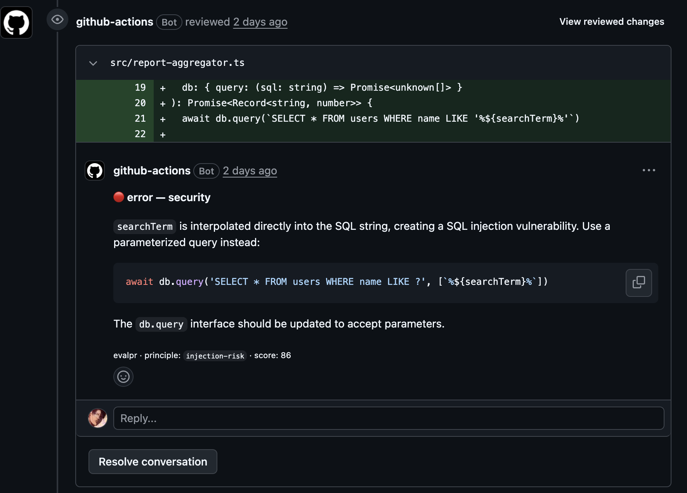
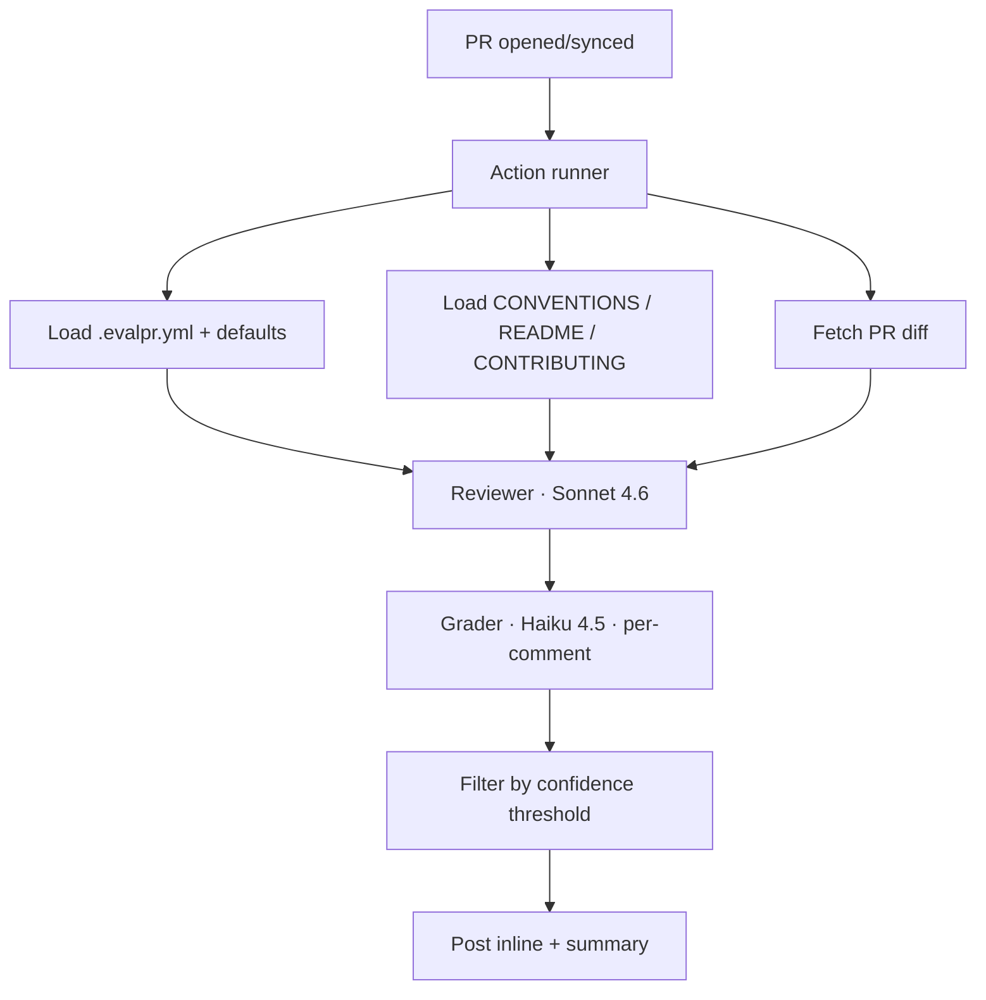

# evalpr

> Eval-graded AI code review for your PRs.


Two LLMs. **Sonnet 4.6** reviews the diff, **Haiku 4.5** grades each finding
0–100, and only high-confidence comments make it onto the PR. Configure the
engineering principles you actually care about — per repo, via `.evalpr.yml`.

<p align="center">
  
</p>

## Why

Most AI code reviewers post too much noise. evalpr grades its own output and
only posts comments above a confidence threshold — and you can tell it which
engineering principles to grade against. Then it publishes precision/recall/F1
against a held-out fixture set so you can audit how good the reviewer actually
is.

## How it works



## Eval results

<!-- EVAL:START -->

_Eval results across 10 fixtures, anthropic/claude-sonnet-4.6 →
anthropic/claude-haiku-4.5, generated 2026-04-28._

| threshold | precision | recall |   F1 | findings/PR |
| --------: | --------: | -----: | ---: | ----------: |
|        50 |      0.58 |   0.88 | 0.70 |         1.2 |
|        60 |      0.58 |   0.88 | 0.70 |         1.2 |
|        70 |      0.58 |   0.88 | 0.70 |         1.2 |
|        80 |      0.78 |   0.88 | 0.82 |         0.9 |
|        90 |      1.00 |   0.50 | 0.67 |         0.4 |

<!-- EVAL:END -->

Default ship threshold: **80** (best F1).

Methodology: 10 hand-authored fixtures spanning 6 languages and 7 principle
categories. Each fixture has an `expected.json` answer key. The runner sweeps 5
confidence thresholds and computes TP/FP/FN against the keys (file equality +
line within range + category equality). Re-run with `npm run eval` and
`npm run eval:render`.

The `pr-006` DRY violation is a measurement artifact: the reviewer correctly
posts 3 comments (one per duplicate handler), but the matcher counts the first
as a TP and the rest as FP — the reviewer is more useful than the precision
number implies. The `pr-008` untested-auth fixture is a structural ceiling for
v0.1 (the reviewer only sees the diff, not the repo file list) — fix queued for
v0.2.

## Install (preview — not yet released)

```yaml
# .github/workflows/evalpr.yml
on:
  pull_request:
    types: [opened, synchronize, reopened, ready_for_review]
jobs:
  review:
    runs-on: ubuntu-latest
    permissions:
      pull-requests: write
      contents: read
    steps:
      - uses: actions/checkout@v4
      - uses: farrellh1/evalpr@v0.1.0
        with:
          api_key: ${{ secrets.OPENROUTER_API_KEY }}
```

Add `OPENROUTER_API_KEY` to your repo secrets. Get a key at
[openrouter.ai/keys](https://openrouter.ai/keys).

## Customize

Drop a `.evalpr.yml` at your repo root:

```yaml
principles:
  add:
    - id: 'result-pattern'
      description: 'Use Result<T, E> over throwing exceptions in domain code'
      severity: warning
      category: maintainability
  remove:
    - 'blocking-io-in-async'

review:
  confidence_threshold: 80
  ignore_paths:
    - 'legacy/**'
    - '*.generated.ts'
```

## Default principles

evalpr ships **17 principles across 7 categories**: correctness, security,
readability, maintainability, performance, testing, project. Curated from _The
Pragmatic Programmer_, _A Philosophy of Software Design_, and _Software
Engineering at Google_ — not Clean Code dogma. See
[`src/default-principles.ts`](src/default-principles.ts).

## Used by

- [farrellh1/evalpr](https://github.com/farrellh1/evalpr) — self-host, dogfood
- [farrellh1/iron_cache](https://github.com/farrellh1/iron_cache) — sample PR:
  [#1](https://github.com/farrellh1/iron_cache/pull/1)

## See it on a real PR

[iron_cache#1](https://github.com/farrellh1/iron_cache/pull/1) — synthetic diff
with intentional issues. The reviewer caught the planted magic numbers **plus
two real bugs** I hadn't intended to plant. Comments are inline on the diff at
scores 81 and 89.

## Known limitations (v0.1.0)

- The `confidence_threshold` is a single number across all categories.
  Per-category thresholds (e.g. higher bar for `readability`, lower for
  `security`) are planned for v0.2.
- The reviewer sees only the PR diff — it cannot detect the absence of a test
  file elsewhere in the repo. v0.2 will pass the full PR file list to lift the
  recall ceiling.
- Fixtures are author-written. v0.2 will draw from real merged-PR diffs in OSS
  repos to remove author-bias from the eval.
- Comments post under the default `github-actions[bot]` identity. v0.2 will ship
  as a proper GitHub App with a branded name + avatar and one-click install —
  see the [v0.2 roadmap](#whats-next-v02).

## What's next (v0.2)

- **Pass full PR file list to the reviewer** — lifts the recall ceiling above
  0.88 by enabling untested-critical-path detection on diffs that don't include
  the relevant test file.
- **Per-category confidence thresholds** — security at 60, style at 90, instead
  of one number for everything.
- **OSS-derived fixtures** — replace the 10 hand-authored fixtures with diffs
  pulled from real merged PRs to eliminate author-bias.
- **Real GitHub App** — branded `evalpr[bot]` identity, custom avatar, one-click
  install via GitHub Marketplace. Backed by a hosted token-minting service so
  consumers don't manage App credentials per-repo.
- **Smarter matcher** — collapse multi-instance findings on the same range into
  one TP so `pr-006`-style cases stop showing as a measurement artifact.

## License

MIT
