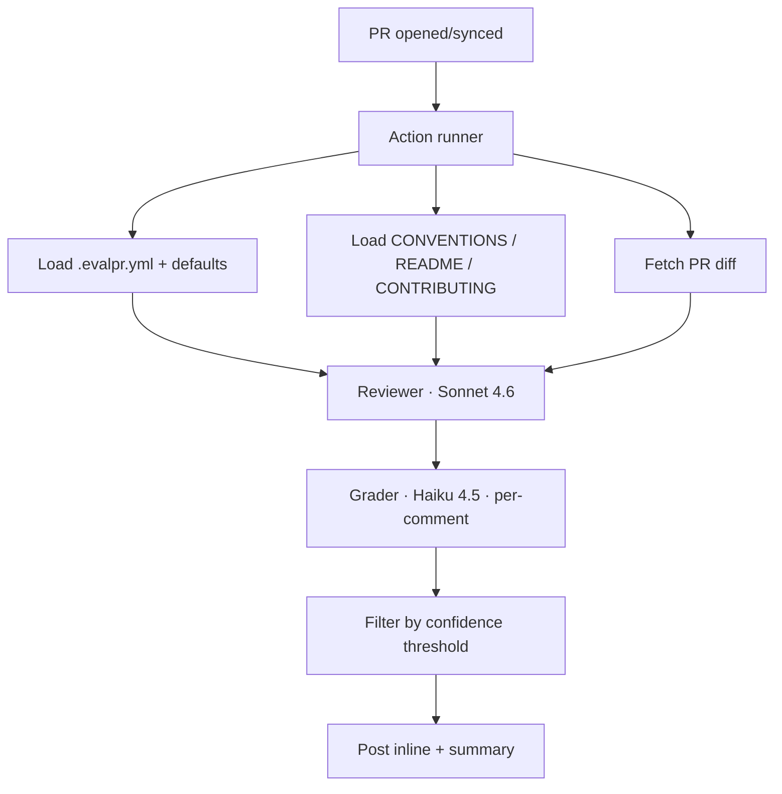

# evalpr Implementation Plan

> **For agentic workers:** REQUIRED SUB-SKILL: Use superpowers:subagent-driven-development (recommended) or superpowers:executing-plans to implement this plan task-by-task. Steps use checkbox (`- [ ]`) syntax for tracking.

**Goal:** Build evalpr — an eval-graded AI code review GitHub Action — over 6 days, ending in a v0.1.0 tag with eval table, dogfood PRs, and a 60-90s Loom.

**Architecture:** TypeScript GitHub Action. Two-LLM pipeline: Sonnet 4.6 reviews PR diffs against a configurable principle set + lightweight RAG context, Haiku 4.5 grades each finding (per-comment, parallel), low-confidence comments are hidden. Quality validated by an offline eval harness on hand-graded fixtures.

**Tech Stack:** Node 20, TypeScript, `@actions/core`, `@actions/github` (Octokit), OpenAI SDK pointed at OpenRouter, Zod, Jest, msw, ncc bundler, minimatch.

**Spec:** `docs/superpowers/specs/2026-04-27-evalpr-design.md`

---

## File structure (locked in spec)

Each task creates/modifies a small, focused file. Boundaries:
- `index.ts` — only file touching `@actions/core` runtime
- `github.ts` — only Octokit caller
- `openrouter.ts` — only HTTP boundary to LLMs
- `reviewer.ts` / `grader.ts` — pure functions, eval-runnable

Full tree in spec. Plan tasks reference paths relative to repo root.

---

## Day 1 — Scaffold

### Task 1: Create repo from template

**Files:**
- Create: `~/Documents/evalpr/` (full template clone)

- [ ] **Step 1: Run gh repo create with template**

```bash
cd ~/Documents
gh repo create farrellh1/evalpr \
  --public \
  --description "Eval-graded AI code review for your PRs" \
  --template actions/typescript-action \
  --clone
cd evalpr
```

Expected: clones `~/Documents/evalpr/` containing `action.yml`, `src/index.ts`, `package.json`, etc. from the template.

- [ ] **Step 2: Verify template installed**

```bash
ls
cat package.json | head -30
```

Expected: `action.yml`, `src/`, `package.json`, `tsconfig.json`, `.github/`, `dist/` all present.

- [ ] **Step 3: Install dependencies**

```bash
npm install
```

Expected: clean install, no security audit failures.

- [ ] **Step 4: Add MIT license**

Run:
```bash
gh repo edit --add-topic github-action --add-topic ai --add-topic code-review --add-topic llm
```

Create `LICENSE` if not provided by template:
```bash
[ -f LICENSE ] || curl -sL https://raw.githubusercontent.com/licenses/license-templates/master/templates/mit.txt > LICENSE
# Edit LICENSE to set year=2026, name=Farrell H.
```

### Task 2: Relocate spec + plan into repo

**Files:**
- Move: `~/Documents/another-me/docs/superpowers/specs/2026-04-27-evalpr-design.md` → `docs/superpowers/specs/`
- Move: `~/Documents/another-me/docs/superpowers/plans/2026-04-27-evalpr.md` → `docs/superpowers/plans/`

- [ ] **Step 1: Create dirs in repo**

```bash
mkdir -p docs/superpowers/specs docs/superpowers/plans
```

- [ ] **Step 2: Move spec + plan**

```bash
mv ~/Documents/another-me/docs/superpowers/specs/2026-04-27-evalpr-design.md docs/superpowers/specs/
mv ~/Documents/another-me/docs/superpowers/plans/2026-04-27-evalpr.md docs/superpowers/plans/
```

- [ ] **Step 3: Update spec front-matter**

In `docs/superpowers/specs/2026-04-27-evalpr-design.md`, remove the `final_location` line — spec is now at its final location.

### Task 3: Customize action.yml

**Files:**
- Modify: `action.yml`

- [ ] **Step 1: Replace template action.yml with locked inputs**

Overwrite `action.yml`:
```yaml
name: 'evalpr'
description: 'Eval-graded AI code review for your PRs'
author: 'farrellh1'
branding:
  icon: 'check-circle'
  color: 'purple'
inputs:
  api_key:
    description: 'OpenRouter API key'
    required: true
  reviewer_model:
    description: 'OpenRouter model id for the reviewer'
    default: 'anthropic/claude-sonnet-4.6'
  grader_model:
    description: 'OpenRouter model id for the grader'
    default: 'anthropic/claude-haiku-4.5'
  confidence_threshold:
    description: 'Minimum final_score (0-100) to retain a finding'
    default: '70'
  ignore_paths:
    description: 'Comma-separated glob patterns to ignore'
    default: 'node_modules/**,*.lock,dist/**,build/**,*.min.js'
  max_files:
    description: 'Skip review if PR changes more files than this'
    default: '20'
  skip_drafts:
    description: 'Skip draft PRs'
    default: 'true'
  config_path:
    description: 'Path to .evalpr.yml in the consumer repo'
    default: '.evalpr.yml'
runs:
  using: 'node20'
  main: 'dist/index.js'
```

### Task 4: Project hygiene files

**Files:**
- Modify: `.gitignore`
- Create: `.env.example`
- Create: `.eslintrc.cjs` (if not from template)
- Create: `.prettierrc` (if not from template)

- [ ] **Step 1: Update .gitignore**

Append to `.gitignore`:
```
.env.local
.env
coverage/
*.log
.DS_Store
fixtures-output/
scripts/eval-results.json.bak
```

- [ ] **Step 2: Create .env.example**

```
# Copy to .env.local for local dev. .env.local is gitignored.
OPENROUTER_API_KEY=sk-or-...
GITHUB_TOKEN=ghp_...                # only needed for local eval against real PRs
```

- [ ] **Step 3: Verify lint + format configs exist**

```bash
ls -la .eslintrc* .prettierrc* 2>/dev/null
```

If missing (template may not include both), create minimal:

`.eslintrc.cjs`:
```js
module.exports = {
  parser: '@typescript-eslint/parser',
  extends: ['plugin:@typescript-eslint/recommended', 'prettier'],
  plugins: ['@typescript-eslint'],
  root: true,
  env: { node: true, jest: true },
  rules: {
    '@typescript-eslint/no-unused-vars': ['error', { argsIgnorePattern: '^_' }],
  },
};
```

`.prettierrc`:
```json
{ "singleQuote": true, "trailingComma": "all", "printWidth": 100 }
```

### Task 5: README skeleton

**Files:**
- Modify: `README.md`

- [ ] **Step 1: Replace template README with skeleton**

```markdown
# evalpr

> Eval-graded AI code review for your PRs.


Two-LLM pipeline: Sonnet 4.6 reviews, Haiku 4.5 grades, low-confidence comments are hidden. Configurable principle set per repo via `.evalpr.yml`.

## Status

🚧 In active development. v0.1.0 target: 2026-05-04.

## Why

Most AI code reviewers post too much noise. evalpr grades its own output and only posts comments above a confidence threshold — and you can tell it which engineering principles to grade against.

## Install (preview — not yet released)

```yaml
# .github/workflows/evalpr.yml
on: [pull_request]
jobs:
  review:
    runs-on: ubuntu-latest
    permissions:
      pull-requests: write
      contents: read
    steps:
      - uses: actions/checkout@v4
      - uses: farrellh1/evalpr@v0.1.0
        with:
          api_key: ${{ secrets.OPENROUTER_API_KEY }}
```

## Eval results

<!-- EVAL:START -->
_(table generated by `npm run eval` on Day 5.5)_
<!-- EVAL:END -->

## License

MIT
```

### Task 6: First commit

- [ ] **Step 1: Verify build works**

```bash
npm run build
```

Expected: produces `dist/index.js` (template ships an example main; we'll replace it).

- [ ] **Step 2: Stage + commit**

```bash
git add -A
git commit -m "feat: scaffold project structure"
```

- [ ] **Step 3: Push**

```bash
git push -u origin main
```

Expected: push succeeds, `farrellh1/evalpr` is live with scaffold.

---

## Day 2 — Schemas + reviewer pipeline

### Task 7: Zod schemas

**Files:**
- Create: `src/schemas.ts`
- Create: `src/types.ts`
- Test: `src/schemas.test.ts`

- [ ] **Step 1: Write the failing test**

`src/schemas.test.ts`:
```ts
import {
  PrincipleSchema,
  ReviewCommentSchema,
  ScoreSchema,
  EvalprConfigSchema,
} from './schemas';

describe('PrincipleSchema', () => {
  it('parses a valid principle', () => {
    const p = PrincipleSchema.parse({
      id: 'no-default-export',
      description: 'No default exports',
      severity: 'suggestion',
      category: 'project',
    });
    expect(p.id).toBe('no-default-export');
  });

  it('rejects an unknown severity', () => {
    expect(() =>
      PrincipleSchema.parse({
        id: 'x',
        description: 'y',
        severity: 'critical',
        category: 'correctness',
      }),
    ).toThrow();
  });

  it('rejects an unknown category', () => {
    expect(() =>
      PrincipleSchema.parse({
        id: 'x',
        description: 'y',
        severity: 'warning',
        category: 'aesthetics',
      }),
    ).toThrow();
  });
});

describe('ReviewCommentSchema', () => {
  it('parses a valid comment', () => {
    const c = ReviewCommentSchema.parse({
      file: 'src/x.ts',
      line: 42,
      type: 'bug',
      severity: 'warning',
      body: 'Possible null deref',
      principle_cited: 'null-undefined-handling',
      reasoning: 'user.email accessed without guard',
    });
    expect(c.line).toBe(42);
  });

  it('rejects negative line numbers', () => {
    expect(() =>
      ReviewCommentSchema.parse({
        file: 'a',
        line: -1,
        type: 'bug',
        severity: 'warning',
        body: 'b',
        principle_cited: 'p',
        reasoning: 'r',
      }),
    ).toThrow();
  });
});

describe('ScoreSchema', () => {
  it('parses a valid score', () => {
    const s = ScoreSchema.parse({
      confidence: 80,
      specificity: 70,
      calibration: 75,
      principle_alignment: 85,
      final_score: 78,
      rationale: 'matches null-handling principle',
    });
    expect(s.final_score).toBe(78);
  });

  it('rejects scores outside 0-100', () => {
    expect(() =>
      ScoreSchema.parse({
        confidence: 150,
        specificity: 70,
        calibration: 75,
        principle_alignment: 85,
        final_score: 78,
        rationale: 'x',
      }),
    ).toThrow();
  });
});

describe('EvalprConfigSchema', () => {
  it('parses an empty config', () => {
    expect(EvalprConfigSchema.parse({})).toEqual({});
  });

  it('parses a config with all sections', () => {
    const c = EvalprConfigSchema.parse({
      principles: {
        add: [
          {
            id: 'x',
            description: 'y',
            severity: 'warning',
            category: 'maintainability',
          },
        ],
        remove: ['old-one'],
        override: [],
      },
      review: { confidence_threshold: 80, ignore_paths: ['legacy/**'] },
    });
    expect(c.review?.confidence_threshold).toBe(80);
  });
});
```

- [ ] **Step 2: Run test to verify it fails**

```bash
npm test -- schemas
```

Expected: FAIL with "Cannot find module './schemas'".

- [ ] **Step 3: Implement schemas**

`src/schemas.ts`:
```ts
import { z } from 'zod';

export const SeverityEnum = z.enum(['info', 'suggestion', 'warning', 'error']);

export const CategoryEnum = z.enum([
  'correctness',
  'security',
  'readability',
  'maintainability',
  'performance',
  'testing',
  'project',
]);

export const PrincipleSchema = z.object({
  id: z.string().min(1),
  description: z.string().min(1),
  severity: SeverityEnum,
  category: CategoryEnum,
});

export const ReviewCommentSchema = z.object({
  file: z.string().min(1),
  line: z.number().int().nonnegative(),
  type: z.enum(['bug', 'security', 'style', 'design', 'perf', 'test']),
  severity: SeverityEnum,
  body: z.string().min(1),
  principle_cited: z.string().min(1),
  reasoning: z.string().min(1),
});

export const ReviewCommentArraySchema = z.array(ReviewCommentSchema);

export const ScoreSchema = z.object({
  confidence: z.number().min(0).max(100),
  specificity: z.number().min(0).max(100),
  calibration: z.number().min(0).max(100),
  principle_alignment: z.number().min(0).max(100),
  final_score: z.number().min(0).max(100),
  rationale: z.string().min(1),
});

export const EvalprConfigSchema = z.object({
  principles: z
    .object({
      add: z.array(PrincipleSchema).optional(),
      remove: z.array(z.string()).optional(),
      override: z.array(PrincipleSchema).optional(),
    })
    .optional(),
  review: z
    .object({
      confidence_threshold: z.number().min(0).max(100).optional(),
      ignore_paths: z.array(z.string()).optional(),
    })
    .optional(),
});
```

`src/types.ts`:
```ts
import { z } from 'zod';
import {
  PrincipleSchema,
  ReviewCommentSchema,
  ScoreSchema,
  EvalprConfigSchema,
} from './schemas';

export type Principle = z.infer<typeof PrincipleSchema>;
export type ReviewComment = z.infer<typeof ReviewCommentSchema>;
export type Score = z.infer<typeof ScoreSchema>;
export type EvalprConfig = z.infer<typeof EvalprConfigSchema>;
export type GradedComment = ReviewComment & { score: Score; retained: boolean };

export interface Context {
  conventions?: string;
  readme?: string;
  contributing?: string;
}
```

Install zod:
```bash
npm install zod
```

- [ ] **Step 4: Run tests to verify they pass**

```bash
npm test -- schemas
```

Expected: all pass.

- [ ] **Step 5: Commit**

```bash
git add src/schemas.ts src/types.ts src/schemas.test.ts package.json package-lock.json
git commit -m "feat(schemas): add zod schemas for principles, comments, scores, config"
```

### Task 8: Default principles

**Files:**
- Create: `src/default-principles.ts`
- Create: `prompts/default-principles.md` (drafting artifact)
- Test: `src/default-principles.test.ts`

- [ ] **Step 1: Write the failing test**

`src/default-principles.test.ts`:
```ts
import { defaultPrinciples } from './default-principles';
import { PrincipleSchema } from './schemas';

describe('defaultPrinciples', () => {
  it('contains 15-20 principles', () => {
    expect(defaultPrinciples.length).toBeGreaterThanOrEqual(15);
    expect(defaultPrinciples.length).toBeLessThanOrEqual(20);
  });

  it('every principle is a valid Principle', () => {
    for (const p of defaultPrinciples) {
      expect(() => PrincipleSchema.parse(p)).not.toThrow();
    }
  });

  it('all ids are unique', () => {
    const ids = defaultPrinciples.map((p) => p.id);
    expect(new Set(ids).size).toBe(ids.length);
  });

  it('covers all 7 categories at least once', () => {
    const categories = new Set(defaultPrinciples.map((p) => p.category));
    expect(categories).toEqual(
      new Set([
        'correctness',
        'security',
        'readability',
        'maintainability',
        'performance',
        'testing',
        'project',
      ]),
    );
  });
});
```

- [ ] **Step 2: Run test to verify it fails**

```bash
npm test -- default-principles
```

Expected: FAIL with "Cannot find module './default-principles'".

- [ ] **Step 3: Implement default principles**

`src/default-principles.ts`:
```ts
import type { Principle } from './types';

export const defaultPrinciples: Principle[] = [
  // correctness
  {
    id: 'null-undefined-handling',
    description:
      'Guard against null/undefined before accessing properties or invoking methods on values that can be absent.',
    severity: 'warning',
    category: 'correctness',
  },
  {
    id: 'error-propagation',
    description:
      'Errors should propagate to a clear handler. Silent catches that swallow errors hide bugs and complicate debugging.',
    severity: 'warning',
    category: 'correctness',
  },
  {
    id: 'off-by-one',
    description:
      'Loop and slice bounds should be checked for off-by-one and inclusive/exclusive mismatches, especially around array and date arithmetic.',
    severity: 'warning',
    category: 'correctness',
  },

  // security
  {
    id: 'input-validation',
    description:
      'Validate untrusted input at trust boundaries. Reject or coerce explicitly; never assume shape from upstream.',
    severity: 'error',
    category: 'security',
  },
  {
    id: 'injection-risk',
    description:
      'Avoid string-concatenated SQL, shell, HTML, or template input. Use parameterized APIs or escape at the boundary.',
    severity: 'error',
    category: 'security',
  },
  {
    id: 'secrets-exposure',
    description:
      'Do not log, commit, or transmit secrets, tokens, or PII. Read from env/secret stores; redact in logs.',
    severity: 'error',
    category: 'security',
  },

  // readability
  {
    id: 'naming-clarity',
    description:
      'Names reveal intent. Single-letter names are acceptable only in tight, conventional scopes (loop indices, math).',
    severity: 'suggestion',
    category: 'readability',
  },
  {
    id: 'intent-over-cleverness',
    description:
      'Prefer the obvious form over a clever one. Optimize for the next reader, not for compactness.',
    severity: 'suggestion',
    category: 'readability',
  },

  // maintainability
  {
    id: 'dry-with-sense',
    description:
      'Eliminate true duplication of logic — but only when the duplicates would change together. Coincidental similarity is not duplication.',
    severity: 'suggestion',
    category: 'maintainability',
  },
  {
    id: 'orthogonality',
    description:
      'Modules should change for one reason. Coupling unrelated concerns into one unit makes change risky.',
    severity: 'warning',
    category: 'maintainability',
  },
  {
    id: 'deep-modules',
    description:
      'Prefer modules with simple interfaces and powerful implementations over many small shallow modules whose interfaces are nearly as large as their bodies.',
    severity: 'suggestion',
    category: 'maintainability',
  },

  // performance
  {
    id: 'obvious-quadratic',
    description:
      'Flag nested loops over the same large input that could be reduced with a hash, set, or single pass. Only when the input size is plausibly large.',
    severity: 'warning',
    category: 'performance',
  },
  {
    id: 'blocking-io-in-async',
    description:
      'Sync filesystem, network, or CPU-heavy work in an async path blocks the event loop. Use async APIs or move work off-thread.',
    severity: 'warning',
    category: 'performance',
  },

  // testing
  {
    id: 'testability',
    description:
      'Code that is hard to test usually has hidden coupling. Pure functions and injected dependencies are easier to test and easier to change.',
    severity: 'suggestion',
    category: 'testing',
  },
  {
    id: 'untested-critical-path',
    description:
      'Branches handling money, auth, security, or data integrity should have explicit test coverage.',
    severity: 'warning',
    category: 'testing',
  },

  // project
  {
    id: 'match-existing-conventions',
    description:
      'Where the project already establishes a pattern (naming, error handling, module layout), follow it. Inconsistency is its own cost.',
    severity: 'suggestion',
    category: 'project',
  },
];
```

`prompts/default-principles.md` (human-readable companion, NOT used at runtime):
```markdown
# evalpr default principle pack

Curated from durable engineering literature. The runtime source of truth is `src/default-principles.ts`.

## Sources

- *The Pragmatic Programmer* — Hunt & Thomas
- *A Philosophy of Software Design* — Ousterhout
- *Software Engineering at Google* — Winters/Manshreck/Wright
- *Effective TypeScript* — Vanderkam
- *Clean Code* — Martin (selectively, naming + clarity only)

## Categories

(See `src/default-principles.ts` for the typed list. This file documents intent.)

- correctness, security, readability, maintainability, performance, testing, project
```

- [ ] **Step 4: Run tests to verify they pass**

```bash
npm test -- default-principles
```

Expected: all pass.

- [ ] **Step 5: Commit**

```bash
git add src/default-principles.ts src/default-principles.test.ts prompts/default-principles.md
git commit -m "feat(principles): add 17 default principles across 7 categories"
```

### Task 9: OpenRouter wrapper

**Files:**
- Create: `src/openrouter.ts`
- Test: `src/openrouter.test.ts`

- [ ] **Step 1: Install openai SDK**

```bash
npm install openai
```

- [ ] **Step 2: Write the failing test**

`src/openrouter.test.ts`:
```ts
import { createOpenRouterClient } from './openrouter';

describe('createOpenRouterClient', () => {
  it('creates a client with the OpenRouter base URL', () => {
    const client = createOpenRouterClient('test-key');
    expect(client.baseURL).toBe('https://openrouter.ai/api/v1');
  });

  it('throws if no api key', () => {
    expect(() => createOpenRouterClient('')).toThrow(/api key/i);
  });
});
```

- [ ] **Step 3: Run test to verify it fails**

```bash
npm test -- openrouter
```

Expected: FAIL.

- [ ] **Step 4: Implement openrouter wrapper**

`src/openrouter.ts`:
```ts
import OpenAI from 'openai';

const OPENROUTER_BASE_URL = 'https://openrouter.ai/api/v1';

export function createOpenRouterClient(apiKey: string): OpenAI {
  if (!apiKey) {
    throw new Error('OpenRouter api key is required');
  }
  return new OpenAI({
    apiKey,
    baseURL: OPENROUTER_BASE_URL,
    defaultHeaders: {
      'HTTP-Referer': 'https://github.com/farrellh1/evalpr',
      'X-Title': 'evalpr',
    },
  });
}

export type OpenRouterClient = OpenAI;
```

- [ ] **Step 5: Run tests to verify they pass**

```bash
npm test -- openrouter
```

Expected: pass.

- [ ] **Step 6: Commit**

```bash
git add src/openrouter.ts src/openrouter.test.ts package.json package-lock.json
git commit -m "feat(openrouter): add thin OpenAI-SDK wrapper for OpenRouter"
```

### Task 10: Reviewer prompt builder

**Files:**
- Create: `src/prompts/reviewer.ts`
- Test: `src/prompts/reviewer.test.ts`

- [ ] **Step 1: Write the failing test**

`src/prompts/reviewer.test.ts`:
```ts
import { buildReviewerPrompt } from './reviewer';
import type { Principle, Context } from '../types';

const principles: Principle[] = [
  {
    id: 'p1',
    description: 'd1',
    severity: 'warning',
    category: 'correctness',
  },
];

describe('buildReviewerPrompt', () => {
  it('includes all principle ids', () => {
    const ctx: Context = {};
    const prompt = buildReviewerPrompt(principles, ctx);
    expect(prompt).toContain('p1');
    expect(prompt).toContain('d1');
  });

  it('includes context sections when present', () => {
    const ctx: Context = {
      conventions: 'CONV',
      readme: 'RDM',
      contributing: 'CONTRIB',
    };
    const prompt = buildReviewerPrompt(principles, ctx);
    expect(prompt).toContain('CONV');
    expect(prompt).toContain('RDM');
    expect(prompt).toContain('CONTRIB');
  });

  it('omits empty context cleanly', () => {
    const prompt = buildReviewerPrompt(principles, {});
    expect(prompt).not.toContain('Project context:');
  });

  it('instructs JSON-only output', () => {
    const prompt = buildReviewerPrompt(principles, {});
    expect(prompt.toLowerCase()).toContain('json');
    expect(prompt).toContain('ReviewComment[]');
  });

  it('snapshots stable output', () => {
    const prompt = buildReviewerPrompt(principles, { conventions: 'X' });
    expect(prompt).toMatchSnapshot();
  });
});
```

- [ ] **Step 2: Run test to verify it fails**

```bash
npm test -- prompts/reviewer
```

Expected: FAIL.

- [ ] **Step 3: Implement reviewer prompt**

`src/prompts/reviewer.ts`:
```ts
import type { Principle, Context } from '../types';

export function buildReviewerPrompt(
  principles: Principle[],
  ctx: Context,
): string {
  const principlesBlock = principles
    .map(
      (p) =>
        `- **${p.id}** [${p.category}, ${p.severity}]: ${p.description}`,
    )
    .join('\n');

  const ctxParts: string[] = [];
  if (ctx.conventions) ctxParts.push(`### CONVENTIONS\n${ctx.conventions}`);
  if (ctx.readme) ctxParts.push(`### README\n${ctx.readme}`);
  if (ctx.contributing) ctxParts.push(`### CONTRIBUTING\n${ctx.contributing}`);
  const ctxBlock =
    ctxParts.length > 0 ? `\nProject context:\n${ctxParts.join('\n\n')}\n` : '';

  return `You are evalpr, a senior code reviewer. Review the provided pull request diff against the configured principles below. Cite the principle id you are invoking for each finding.

Configured principles:
${principlesBlock}
${ctxBlock}
Output rules:
- Output ONLY a JSON array matching the ReviewComment[] schema.
- ReviewComment = { file: string, line: number, type: 'bug'|'security'|'style'|'design'|'perf'|'test', severity: 'info'|'suggestion'|'warning'|'error', body: string, principle_cited: string, reasoning: string }
- 'line' is the line number on the RIGHT side of the diff (post-change).
- 'principle_cited' MUST be one of the configured principle ids above.
- Be specific: cite the exact line, the exact problem, the exact remedy.
- Do not nitpick whitespace, formatting, or anything a linter would catch.
- If the diff has no real issues, return [].
- Output the JSON array and nothing else. No markdown fences, no prose.`;
}
```

- [ ] **Step 4: Run tests to verify they pass**

```bash
npm test -- prompts/reviewer -u
```

Expected: pass; snapshot file written.

- [ ] **Step 5: Commit**

```bash
git add src/prompts/reviewer.ts src/prompts/reviewer.test.ts src/prompts/__snapshots__/
git commit -m "feat(prompts): add reviewer system prompt builder"
```

### Task 11: Reviewer caller

**Files:**
- Create: `src/reviewer.ts`
- Test: `src/reviewer.test.ts`

- [ ] **Step 1: Write the failing test**

`src/reviewer.test.ts`:
```ts
import { callReviewer } from './reviewer';
import type { Principle, Context } from './types';

const fakeClient = {
  chat: {
    completions: {
      create: jest.fn(),
    },
  },
};

const principles: Principle[] = [
  { id: 'p1', description: 'd1', severity: 'warning', category: 'correctness' },
];
const ctx: Context = {};

describe('callReviewer', () => {
  beforeEach(() => fakeClient.chat.completions.create.mockReset());

  it('parses a valid JSON array response', async () => {
    fakeClient.chat.completions.create.mockResolvedValueOnce({
      choices: [
        {
          message: {
            content: JSON.stringify([
              {
                file: 'a.ts',
                line: 1,
                type: 'bug',
                severity: 'warning',
                body: 'b',
                principle_cited: 'p1',
                reasoning: 'r',
              },
            ]),
          },
        },
      ],
    });

    const result = await callReviewer(
      fakeClient as never,
      'anthropic/claude-sonnet-4.6',
      'diff content',
      principles,
      ctx,
    );

    expect(result).toHaveLength(1);
    expect(result[0].file).toBe('a.ts');
  });

  it('strips markdown code fences if present', async () => {
    fakeClient.chat.completions.create.mockResolvedValueOnce({
      choices: [
        {
          message: {
            content: '```json\n[]\n```',
          },
        },
      ],
    });

    const result = await callReviewer(
      fakeClient as never,
      'm',
      'd',
      principles,
      ctx,
    );
    expect(result).toEqual([]);
  });

  it('retries once on malformed JSON, then throws', async () => {
    fakeClient.chat.completions.create.mockResolvedValue({
      choices: [{ message: { content: 'not json' } }],
    });

    await expect(
      callReviewer(fakeClient as never, 'm', 'd', principles, ctx),
    ).rejects.toThrow(/malformed/i);

    expect(fakeClient.chat.completions.create).toHaveBeenCalledTimes(2);
  });

  it('rejects on Zod validation failure even if JSON parses', async () => {
    fakeClient.chat.completions.create.mockResolvedValue({
      choices: [
        {
          message: {
            content: JSON.stringify([{ file: 'a' }]), // missing required fields
          },
        },
      ],
    });

    await expect(
      callReviewer(fakeClient as never, 'm', 'd', principles, ctx),
    ).rejects.toThrow();
    expect(fakeClient.chat.completions.create).toHaveBeenCalledTimes(2);
  });
});
```

- [ ] **Step 2: Run test to verify it fails**

```bash
npm test -- src/reviewer
```

Expected: FAIL.

- [ ] **Step 3: Implement reviewer**

`src/reviewer.ts`:
```ts
import type { OpenRouterClient } from './openrouter';
import type { Principle, Context, ReviewComment } from './types';
import { ReviewCommentArraySchema } from './schemas';
import { buildReviewerPrompt } from './prompts/reviewer';

const FENCE = /^```(?:json)?\s*\n([\s\S]*?)\n```$/;

function stripFences(text: string): string {
  const trimmed = text.trim();
  const m = trimmed.match(FENCE);
  return m ? m[1].trim() : trimmed;
}

async function callOnce(
  client: OpenRouterClient,
  model: string,
  systemPrompt: string,
  userPrompt: string,
): Promise<string> {
  const res = await client.chat.completions.create({
    model,
    messages: [
      { role: 'system', content: systemPrompt },
      { role: 'user', content: userPrompt },
    ],
    temperature: 0.2,
  });
  return res.choices[0]?.message?.content ?? '';
}

export async function callReviewer(
  client: OpenRouterClient,
  model: string,
  diff: string,
  principles: Principle[],
  ctx: Context,
): Promise<ReviewComment[]> {
  const systemPrompt = buildReviewerPrompt(principles, ctx);
  const userPrompt = `Pull request diff:\n\n${diff}`;

  let lastError: unknown;
  for (let attempt = 0; attempt < 2; attempt++) {
    try {
      const reminder =
        attempt === 0
          ? ''
          : '\n\nIMPORTANT: Output ONLY a valid JSON array. No markdown, no prose.';
      const content = await callOnce(
        client,
        model,
        systemPrompt + reminder,
        userPrompt,
      );
      const stripped = stripFences(content);
      const parsed = JSON.parse(stripped);
      return ReviewCommentArraySchema.parse(parsed);
    } catch (err) {
      lastError = err;
    }
  }
  throw new Error(
    `Reviewer output malformed after retry: ${(lastError as Error).message}`,
  );
}
```

- [ ] **Step 4: Run tests to verify they pass**

```bash
npm test -- src/reviewer
```

Expected: pass.

- [ ] **Step 5: Commit**

```bash
git add src/reviewer.ts src/reviewer.test.ts
git commit -m "feat(reviewer): add Sonnet caller with JSON parse + Zod validation + retry"
```

---

## Day 3 — Grader + threshold filter

### Task 12: Grader prompt builder

**Files:**
- Create: `src/prompts/grader.ts`
- Test: `src/prompts/grader.test.ts`

- [ ] **Step 1: Write the failing test**

`src/prompts/grader.test.ts`:
```ts
import { buildGraderPrompt } from './grader';
import type { Principle, Context, ReviewComment } from '../types';

const principles: Principle[] = [
  { id: 'p1', description: 'd1', severity: 'warning', category: 'correctness' },
];
const comment: ReviewComment = {
  file: 'a.ts',
  line: 1,
  type: 'bug',
  severity: 'warning',
  body: 'body',
  principle_cited: 'p1',
  reasoning: 'r',
};

describe('buildGraderPrompt', () => {
  it('includes the comment under review', () => {
    const prompt = buildGraderPrompt(comment, principles, {});
    expect(prompt).toContain('body');
    expect(prompt).toContain('p1');
  });

  it('lists the four scoring dimensions', () => {
    const prompt = buildGraderPrompt(comment, principles, {});
    expect(prompt).toContain('confidence');
    expect(prompt).toContain('specificity');
    expect(prompt).toContain('calibration');
    expect(prompt).toContain('principle_alignment');
  });

  it('describes Score JSON schema', () => {
    const prompt = buildGraderPrompt(comment, principles, {});
    expect(prompt).toContain('final_score');
    expect(prompt).toContain('rationale');
  });

  it('snapshots stable output', () => {
    const prompt = buildGraderPrompt(comment, principles, {});
    expect(prompt).toMatchSnapshot();
  });
});
```

- [ ] **Step 2: Run test to verify it fails**

```bash
npm test -- prompts/grader
```

Expected: FAIL.

- [ ] **Step 3: Implement grader prompt**

`src/prompts/grader.ts`:
```ts
import type { Principle, Context, ReviewComment } from '../types';

export function buildGraderPrompt(
  comment: ReviewComment,
  principles: Principle[],
  ctx: Context,
): string {
  const principlesBlock = principles
    .map((p) => `- **${p.id}** [${p.category}, ${p.severity}]: ${p.description}`)
    .join('\n');

  const ctxParts: string[] = [];
  if (ctx.conventions) ctxParts.push(`### CONVENTIONS\n${ctx.conventions}`);
  if (ctx.readme) ctxParts.push(`### README\n${ctx.readme}`);
  if (ctx.contributing) ctxParts.push(`### CONTRIBUTING\n${ctx.contributing}`);
  const ctxBlock =
    ctxParts.length > 0 ? `\nProject context:\n${ctxParts.join('\n\n')}\n` : '';

  return `You are evalpr's grader. A reviewer LLM produced a code review comment. Score it on four dimensions, each 0-100:

1. confidence: how likely is this finding a real, actionable issue?
2. specificity: does it cite concrete code, line, and a concrete fix — not vague advice?
3. calibration: is the claimed severity reasonable? (style nit at 'error' is bad calibration)
4. principle_alignment: does the cited principle id exist in the configured set, and does the reasoning actually follow from it? Penalize if principle_cited is not in the configured list, or if the reasoning contradicts project conventions.

Configured principles:
${principlesBlock}
${ctxBlock}
Comment under review:
- file: ${comment.file}
- line: ${comment.line}
- type: ${comment.type}
- severity: ${comment.severity}
- principle_cited: ${comment.principle_cited}
- reasoning: ${comment.reasoning}
- body: ${comment.body}

Output rules:
- Output ONLY a JSON object matching the Score schema.
- Score = { confidence: number, specificity: number, calibration: number, principle_alignment: number, final_score: number, rationale: string }
- final_score = 0.40*confidence + 0.25*principle_alignment + 0.20*specificity + 0.15*calibration (rounded to integer).
- rationale: 1-2 sentences, plain text.
- Output JSON only. No markdown fences, no prose.`;
}
```

- [ ] **Step 4: Run tests to verify they pass**

```bash
npm test -- prompts/grader -u
```

Expected: pass.

- [ ] **Step 5: Commit**

```bash
git add src/prompts/grader.ts src/prompts/grader.test.ts src/prompts/__snapshots__/
git commit -m "feat(prompts): add grader system prompt builder"
```

### Task 13: Grader caller

**Files:**
- Create: `src/grader.ts`
- Test: `src/grader.test.ts`

- [ ] **Step 1: Write the failing test**

`src/grader.test.ts`:
```ts
import { gradeComment, gradeAll } from './grader';
import type { Principle, ReviewComment } from './types';

const fakeClient = {
  chat: { completions: { create: jest.fn() } },
};

const principles: Principle[] = [
  { id: 'p1', description: 'd', severity: 'warning', category: 'correctness' },
];

const comment: ReviewComment = {
  file: 'a.ts',
  line: 1,
  type: 'bug',
  severity: 'warning',
  body: 'b',
  principle_cited: 'p1',
  reasoning: 'r',
};

const validScore = {
  confidence: 80,
  specificity: 70,
  calibration: 75,
  principle_alignment: 85,
  final_score: 78,
  rationale: 'matches',
};

describe('gradeComment', () => {
  beforeEach(() => fakeClient.chat.completions.create.mockReset());

  it('returns a parsed Score', async () => {
    fakeClient.chat.completions.create.mockResolvedValueOnce({
      choices: [{ message: { content: JSON.stringify(validScore) } }],
    });
    const score = await gradeComment(
      fakeClient as never,
      'm',
      comment,
      principles,
      {},
    );
    expect(score.final_score).toBe(78);
  });

  it('returns confidence=0 score on persistent malformed output', async () => {
    fakeClient.chat.completions.create.mockResolvedValue({
      choices: [{ message: { content: 'broken' } }],
    });
    const score = await gradeComment(
      fakeClient as never,
      'm',
      comment,
      principles,
      {},
    );
    expect(score.confidence).toBe(0);
    expect(score.final_score).toBe(0);
    expect(fakeClient.chat.completions.create).toHaveBeenCalledTimes(2);
  });
});

describe('gradeAll', () => {
  it('grades comments in parallel', async () => {
    fakeClient.chat.completions.create.mockResolvedValue({
      choices: [{ message: { content: JSON.stringify(validScore) } }],
    });
    const comments = [comment, { ...comment, file: 'b.ts' }, { ...comment, file: 'c.ts' }];
    const scored = await gradeAll(
      fakeClient as never,
      'm',
      comments,
      principles,
      {},
    );
    expect(scored).toHaveLength(3);
    expect(scored.every((s) => s.score.final_score === 78)).toBe(true);
  });
});
```

- [ ] **Step 2: Run test to verify it fails**

```bash
npm test -- src/grader
```

Expected: FAIL.

- [ ] **Step 3: Implement grader**

`src/grader.ts`:
```ts
import type { OpenRouterClient } from './openrouter';
import type {
  Principle,
  Context,
  ReviewComment,
  Score,
  GradedComment,
} from './types';
import { ScoreSchema } from './schemas';
import { buildGraderPrompt } from './prompts/grader';

const FENCE = /^```(?:json)?\s*\n([\s\S]*?)\n```$/;

function stripFences(text: string): string {
  const t = text.trim();
  const m = t.match(FENCE);
  return m ? m[1].trim() : t;
}

const FAILED_SCORE: Score = {
  confidence: 0,
  specificity: 0,
  calibration: 0,
  principle_alignment: 0,
  final_score: 0,
  rationale: 'grader output malformed; comment hidden',
};

export async function gradeComment(
  client: OpenRouterClient,
  model: string,
  comment: ReviewComment,
  principles: Principle[],
  ctx: Context,
): Promise<Score> {
  const systemPrompt = buildGraderPrompt(comment, principles, ctx);
  for (let attempt = 0; attempt < 2; attempt++) {
    try {
      const reminder =
        attempt === 0
          ? ''
          : '\n\nIMPORTANT: Output ONLY a valid JSON object. No markdown, no prose.';
      const res = await client.chat.completions.create({
        model,
        messages: [
          { role: 'system', content: systemPrompt + reminder },
          { role: 'user', content: 'Score the comment above.' },
        ],
        temperature: 0,
      });
      const content = res.choices[0]?.message?.content ?? '';
      const stripped = stripFences(content);
      const parsed = JSON.parse(stripped);
      return ScoreSchema.parse(parsed);
    } catch {
      // continue
    }
  }
  return FAILED_SCORE;
}

export async function gradeAll(
  client: OpenRouterClient,
  model: string,
  comments: ReviewComment[],
  principles: Principle[],
  ctx: Context,
): Promise<GradedComment[]> {
  const scores = await Promise.all(
    comments.map((c) => gradeComment(client, model, c, principles, ctx)),
  );
  return comments.map((c, i) => ({ ...c, score: scores[i], retained: false }));
}
```

- [ ] **Step 4: Run tests to verify they pass**

```bash
npm test -- src/grader
```

Expected: pass.

- [ ] **Step 5: Commit**

```bash
git add src/grader.ts src/grader.test.ts
git commit -m "feat(grader): add per-comment Haiku grader with parallel gradeAll"
```

### Task 14: Threshold filter

**Files:**
- Create: `src/filter.ts`
- Test: `src/filter.test.ts`

- [ ] **Step 1: Write the failing test**

`src/filter.test.ts`:
```ts
import { filterByThreshold } from './filter';
import type { GradedComment } from './types';

const make = (final_score: number, file = 'a.ts'): GradedComment => ({
  file,
  line: 1,
  type: 'bug',
  severity: 'warning',
  body: 'b',
  principle_cited: 'p',
  reasoning: 'r',
  score: {
    confidence: final_score,
    specificity: final_score,
    calibration: final_score,
    principle_alignment: final_score,
    final_score,
    rationale: 'x',
  },
  retained: false,
});

describe('filterByThreshold', () => {
  it('marks comments at or above threshold as retained', () => {
    const out = filterByThreshold([make(70), make(69)], 70);
    expect(out[0].retained).toBe(true);
    expect(out[1].retained).toBe(false);
  });

  it('all retained when threshold is 0', () => {
    const out = filterByThreshold([make(0), make(50), make(100)], 0);
    expect(out.every((c) => c.retained)).toBe(true);
  });

  it('none retained when threshold is 101', () => {
    const out = filterByThreshold([make(100)], 101);
    expect(out[0].retained).toBe(false);
  });
});
```

- [ ] **Step 2: Run test to verify it fails**

```bash
npm test -- src/filter
```

Expected: FAIL.

- [ ] **Step 3: Implement filter**

`src/filter.ts`:
```ts
import type { GradedComment } from './types';

export function filterByThreshold(
  comments: GradedComment[],
  threshold: number,
): GradedComment[] {
  return comments.map((c) => ({
    ...c,
    retained: c.score.final_score >= threshold,
  }));
}
```

- [ ] **Step 4: Run tests to verify they pass**

```bash
npm test -- src/filter
```

Expected: pass.

- [ ] **Step 5: Commit**

```bash
git add src/filter.ts src/filter.test.ts
git commit -m "feat(filter): add threshold-based retain flag"
```

---

## Day 4 — Lightweight RAG + filters + config reader

### Task 15: Context loader (lightweight RAG)

**Files:**
- Create: `src/context.ts`
- Test: `src/context.test.ts`

- [ ] **Step 1: Install memfs for filesystem mocking**

```bash
npm install --save-dev memfs
```

- [ ] **Step 2: Write the failing test**

`src/context.test.ts`:
```ts
import { vol } from 'memfs';
jest.mock('node:fs/promises', () => require('memfs').fs.promises);

import { loadContext, MAX_PER_FILE_BYTES, MAX_TOTAL_BYTES } from './context';

beforeEach(() => vol.reset());

describe('loadContext', () => {
  it('returns empty when no files present', async () => {
    vol.fromJSON({ '/repo/.gitkeep': '' });
    const ctx = await loadContext('/repo');
    expect(ctx).toEqual({});
  });

  it('reads CONVENTIONS.md, README.md, CONTRIBUTING.md', async () => {
    vol.fromJSON({
      '/repo/CONVENTIONS.md': 'conv',
      '/repo/README.md': 'rdm',
      '/repo/CONTRIBUTING.md': 'contrib',
    });
    const ctx = await loadContext('/repo');
    expect(ctx.conventions).toBe('conv');
    expect(ctx.readme).toBe('rdm');
    expect(ctx.contributing).toBe('contrib');
  });

  it('truncates files larger than per-file budget', async () => {
    const big = 'x'.repeat(MAX_PER_FILE_BYTES + 100);
    vol.fromJSON({ '/repo/README.md': big });
    const ctx = await loadContext('/repo');
    expect(ctx.readme!.length).toBeLessThanOrEqual(MAX_PER_FILE_BYTES + 200); // truncation marker
    expect(ctx.readme).toMatch(/\[truncated\]/);
  });

  it('respects total context budget', async () => {
    const each = 'x'.repeat(MAX_PER_FILE_BYTES);
    vol.fromJSON({
      '/repo/CONVENTIONS.md': each,
      '/repo/README.md': each,
      '/repo/CONTRIBUTING.md': each,
    });
    const ctx = await loadContext('/repo');
    const total =
      (ctx.conventions?.length ?? 0) +
      (ctx.readme?.length ?? 0) +
      (ctx.contributing?.length ?? 0);
    expect(total).toBeLessThanOrEqual(MAX_TOTAL_BYTES + 600); // markers
  });
});
```

- [ ] **Step 3: Run test to verify it fails**

```bash
npm test -- src/context
```

Expected: FAIL.

- [ ] **Step 4: Implement context loader**

`src/context.ts`:
```ts
import { readFile } from 'node:fs/promises';
import { join } from 'node:path';
import type { Context } from './types';

export const MAX_PER_FILE_BYTES = 4 * 1024;
export const MAX_TOTAL_BYTES = 12 * 1024;
const TRUNCATION_MARKER = '\n\n[truncated]';

async function tryRead(repoRoot: string, name: string): Promise<string | undefined> {
  try {
    return await readFile(join(repoRoot, name), 'utf8');
  } catch {
    return undefined;
  }
}

function clip(text: string, max: number): string {
  if (text.length <= max) return text;
  return text.slice(0, max) + TRUNCATION_MARKER;
}

export async function loadContext(repoRoot: string): Promise<Context> {
  const [conventions, readme, contributing] = await Promise.all([
    tryRead(repoRoot, 'CONVENTIONS.md'),
    tryRead(repoRoot, 'README.md'),
    tryRead(repoRoot, 'CONTRIBUTING.md'),
  ]);

  const ctx: Context = {};
  let used = 0;

  const slot = (text: string | undefined): string | undefined => {
    if (text === undefined) return undefined;
    const remaining = MAX_TOTAL_BYTES - used;
    if (remaining <= 0) return undefined;
    const perFileMax = Math.min(MAX_PER_FILE_BYTES, remaining);
    const out = clip(text, perFileMax);
    used += out.length;
    return out;
  };

  ctx.conventions = slot(conventions);
  ctx.readme = slot(readme);
  ctx.contributing = slot(contributing);

  // Drop undefined keys for cleaner output
  if (ctx.conventions === undefined) delete ctx.conventions;
  if (ctx.readme === undefined) delete ctx.readme;
  if (ctx.contributing === undefined) delete ctx.contributing;

  return ctx;
}
```

- [ ] **Step 5: Run tests to verify they pass**

```bash
npm test -- src/context
```

Expected: pass.

- [ ] **Step 6: Commit**

```bash
git add src/context.ts src/context.test.ts package.json package-lock.json
git commit -m "feat(context): add lightweight RAG loader with 4KB/12KB budgets"
```

### Task 16: Config loader + principle merge

**Files:**
- Create: `src/config.ts`
- Test: `src/config.test.ts`

- [ ] **Step 1: Install yaml**

```bash
npm install yaml
```

- [ ] **Step 2: Write the failing test**

`src/config.test.ts`:
```ts
import { vol } from 'memfs';
jest.mock('node:fs/promises', () => require('memfs').fs.promises);

import { loadConfig, mergePrinciples } from './config';
import type { Principle } from './types';

beforeEach(() => vol.reset());

describe('loadConfig', () => {
  it('returns empty config when file is missing', async () => {
    vol.fromJSON({ '/repo/.gitkeep': '' });
    expect(await loadConfig('/repo', '.evalpr.yml')).toEqual({});
  });

  it('parses a valid yaml config', async () => {
    vol.fromJSON({
      '/repo/.evalpr.yml':
        'review:\n  confidence_threshold: 80\n  ignore_paths:\n    - "legacy/**"\n',
    });
    const cfg = await loadConfig('/repo', '.evalpr.yml');
    expect(cfg.review?.confidence_threshold).toBe(80);
  });

  it('returns empty config on malformed yaml (does not throw)', async () => {
    vol.fromJSON({ '/repo/.evalpr.yml': 'bad: : :' });
    expect(await loadConfig('/repo', '.evalpr.yml')).toEqual({});
  });
});

const defaults: Principle[] = [
  { id: 'a', description: 'a', severity: 'warning', category: 'correctness' },
  { id: 'b', description: 'b', severity: 'warning', category: 'correctness' },
];

describe('mergePrinciples', () => {
  it('returns defaults when config is empty', () => {
    expect(mergePrinciples(defaults, {})).toEqual(defaults);
  });

  it('removes principles by id', () => {
    expect(mergePrinciples(defaults, { principles: { remove: ['a'] } })).toEqual([
      defaults[1],
    ]);
  });

  it('adds new principles', () => {
    const added: Principle = {
      id: 'c',
      description: 'c',
      severity: 'warning',
      category: 'project',
    };
    const out = mergePrinciples(defaults, { principles: { add: [added] } });
    expect(out).toHaveLength(3);
    expect(out.find((p) => p.id === 'c')).toEqual(added);
  });

  it('overrides existing principles by id', () => {
    const override: Principle = {
      id: 'a',
      description: 'NEW',
      severity: 'error',
      category: 'correctness',
    };
    const out = mergePrinciples(defaults, {
      principles: { override: [override] },
    });
    expect(out.find((p) => p.id === 'a')?.description).toBe('NEW');
  });

  it('add of an existing id wins (treated as override)', () => {
    const dup: Principle = {
      id: 'a',
      description: 'DUP',
      severity: 'error',
      category: 'correctness',
    };
    const out = mergePrinciples(defaults, { principles: { add: [dup] } });
    expect(out.find((p) => p.id === 'a')?.description).toBe('DUP');
  });
});
```

- [ ] **Step 3: Run test to verify it fails**

```bash
npm test -- src/config
```

Expected: FAIL.

- [ ] **Step 4: Implement config**

`src/config.ts`:
```ts
import { readFile } from 'node:fs/promises';
import { join } from 'node:path';
import { parse as parseYaml } from 'yaml';
import { EvalprConfigSchema } from './schemas';
import type { EvalprConfig, Principle } from './types';

export async function loadConfig(
  repoRoot: string,
  configPath: string,
): Promise<EvalprConfig> {
  let raw: string;
  try {
    raw = await readFile(join(repoRoot, configPath), 'utf8');
  } catch {
    return {};
  }
  try {
    const parsed = parseYaml(raw) ?? {};
    return EvalprConfigSchema.parse(parsed);
  } catch {
    return {};
  }
}

export function mergePrinciples(
  defaults: Principle[],
  cfg: EvalprConfig,
): Principle[] {
  const removed = new Set(cfg.principles?.remove ?? []);
  const overrides = new Map(
    (cfg.principles?.override ?? []).map((p) => [p.id, p]),
  );
  const adds = cfg.principles?.add ?? [];

  // Treat 'add' of an existing id as an override
  for (const a of adds) {
    overrides.set(a.id, a);
  }

  const merged: Principle[] = [];
  const seen = new Set<string>();
  for (const p of defaults) {
    if (removed.has(p.id)) continue;
    const o = overrides.get(p.id);
    merged.push(o ?? p);
    seen.add(p.id);
  }
  // Append truly new adds (ids not already in defaults)
  for (const a of adds) {
    if (!seen.has(a.id)) {
      merged.push(a);
      seen.add(a.id);
    }
  }

  return merged;
}
```

- [ ] **Step 5: Run tests to verify they pass**

```bash
npm test -- src/config
```

Expected: pass.

- [ ] **Step 6: Commit**

```bash
git add src/config.ts src/config.test.ts package.json package-lock.json
git commit -m "feat(config): add .evalpr.yml loader and principle merger"
```

### Task 17: PR + path filters

**Files:**
- Create: `src/filters.ts`
- Test: `src/filters.test.ts`

- [ ] **Step 1: Install minimatch**

```bash
npm install minimatch
```

- [ ] **Step 2: Write the failing test**

`src/filters.test.ts`:
```ts
import {
  shouldSkipPR,
  applyIgnorePaths,
  type SkipReason,
  type PRMeta,
} from './filters';

const basePR: PRMeta = {
  draft: false,
  user_type: 'User',
  title: 'Add feature',
  changed_files: 5,
};

describe('shouldSkipPR', () => {
  it('does not skip a normal PR', () => {
    expect(
      shouldSkipPR(basePR, { skipDrafts: true, maxFiles: 20 }),
    ).toBeNull();
  });

  it('skips drafts when enabled', () => {
    expect(
      shouldSkipPR({ ...basePR, draft: true }, { skipDrafts: true, maxFiles: 20 }),
    ).toBe<SkipReason>('draft');
  });

  it('does not skip drafts when disabled', () => {
    expect(
      shouldSkipPR({ ...basePR, draft: true }, { skipDrafts: false, maxFiles: 20 }),
    ).toBeNull();
  });

  it('always skips bots', () => {
    expect(
      shouldSkipPR(
        { ...basePR, user_type: 'Bot' },
        { skipDrafts: false, maxFiles: 20 },
      ),
    ).toBe<SkipReason>('bot');
  });

  it('skips when [skip-review] in title', () => {
    expect(
      shouldSkipPR(
        { ...basePR, title: 'Hotfix [skip-review]' },
        { skipDrafts: true, maxFiles: 20 },
      ),
    ).toBe<SkipReason>('skip-tag');
  });

  it('skips when too many files', () => {
    expect(
      shouldSkipPR(
        { ...basePR, changed_files: 50 },
        { skipDrafts: true, maxFiles: 20 },
      ),
    ).toBe<SkipReason>('max-files');
  });
});

describe('applyIgnorePaths', () => {
  it('passes when no ignore paths match', () => {
    expect(applyIgnorePaths('src/x.ts', ['legacy/**'])).toBe(false);
  });

  it('ignores when a glob matches', () => {
    expect(applyIgnorePaths('legacy/old.ts', ['legacy/**'])).toBe(true);
  });

  it('ignores generated files', () => {
    expect(applyIgnorePaths('src/proto.generated.ts', ['*.generated.ts'])).toBe(
      true,
    );
  });

  it('handles multiple patterns', () => {
    const patterns = ['node_modules/**', 'dist/**', '*.lock'];
    expect(applyIgnorePaths('node_modules/x.js', patterns)).toBe(true);
    expect(applyIgnorePaths('package-lock.json', patterns)).toBe(true);
    expect(applyIgnorePaths('src/x.ts', patterns)).toBe(false);
  });
});
```

- [ ] **Step 3: Run test to verify it fails**

```bash
npm test -- src/filters
```

Expected: FAIL.

- [ ] **Step 4: Implement filters**

`src/filters.ts`:
```ts
import { minimatch } from 'minimatch';

export interface PRMeta {
  draft: boolean;
  user_type: string;
  title: string;
  changed_files: number;
}

export type SkipReason = 'draft' | 'bot' | 'skip-tag' | 'max-files';

export interface FilterOptions {
  skipDrafts: boolean;
  maxFiles: number;
}

export function shouldSkipPR(
  pr: PRMeta,
  opts: FilterOptions,
): SkipReason | null {
  if (pr.user_type === 'Bot') return 'bot';
  if (opts.skipDrafts && pr.draft) return 'draft';
  if (pr.title.includes('[skip-review]')) return 'skip-tag';
  if (pr.changed_files > opts.maxFiles) return 'max-files';
  return null;
}

export function applyIgnorePaths(file: string, patterns: string[]): boolean {
  return patterns.some((p) => minimatch(file, p, { matchBase: true, dot: true }));
}
```

- [ ] **Step 5: Run tests to verify they pass**

```bash
npm test -- src/filters
```

Expected: pass.

- [ ] **Step 6: Commit**

```bash
git add src/filters.ts src/filters.test.ts package.json package-lock.json
git commit -m "feat(filters): add PR skip rules and path glob ignoring"
```

---

## Day 5 — GitHub I/O + orchestrator + dogfood

### Task 18: GitHub wrapper (fetchDiff + postReview)

**Files:**
- Create: `src/github.ts`
- Test: `src/github.test.ts`

- [ ] **Step 1: Write the failing test**

`src/github.test.ts`:
```ts
import { fetchDiff, postReview } from './github';
import type { GradedComment } from './types';

const fakeOctokit = {
  rest: {
    pulls: {
      get: jest.fn(),
      createReviewComment: jest.fn(),
      createReview: jest.fn(),
    },
  },
};

const ref = { owner: 'o', repo: 'r', pull_number: 1 };

beforeEach(() => {
  fakeOctokit.rest.pulls.get.mockReset();
  fakeOctokit.rest.pulls.createReviewComment.mockReset();
  fakeOctokit.rest.pulls.createReview.mockReset();
});

describe('fetchDiff', () => {
  it('requests diff format and returns string', async () => {
    fakeOctokit.rest.pulls.get.mockResolvedValueOnce({ data: 'diff content' });
    const diff = await fetchDiff(fakeOctokit as never, ref);
    expect(diff).toBe('diff content');
    const call = fakeOctokit.rest.pulls.get.mock.calls[0][0];
    expect(call.mediaType.format).toBe('diff');
  });
});

const make = (file: string, line: number, retained = true): GradedComment => ({
  file,
  line,
  type: 'bug',
  severity: 'warning',
  body: `Issue at ${file}:${line}`,
  principle_cited: 'p',
  reasoning: 'r',
  score: {
    confidence: 80,
    specificity: 80,
    calibration: 80,
    principle_alignment: 80,
    final_score: 80,
    rationale: 'x',
  },
  retained,
});

describe('postReview', () => {
  it('posts inline comment per retained comment + summary', async () => {
    const retained = [make('a.ts', 1), make('b.ts', 2)];
    fakeOctokit.rest.pulls.createReviewComment.mockResolvedValue({});
    fakeOctokit.rest.pulls.createReview.mockResolvedValue({});

    await postReview(fakeOctokit as never, ref, retained, 3, 'commit-sha', ['p']);

    expect(fakeOctokit.rest.pulls.createReviewComment).toHaveBeenCalledTimes(2);
    expect(fakeOctokit.rest.pulls.createReview).toHaveBeenCalledTimes(1);

    const summary = fakeOctokit.rest.pulls.createReview.mock.calls[0][0].body;
    expect(summary).toMatch(/2 high-confidence/);
    expect(summary).toMatch(/3 low-confidence/);
  });

  it('continues if one inline comment fails', async () => {
    const retained = [make('a.ts', 1), make('b.ts', 2)];
    fakeOctokit.rest.pulls.createReviewComment
      .mockRejectedValueOnce(new Error('rate limit'))
      .mockResolvedValueOnce({});
    fakeOctokit.rest.pulls.createReview.mockResolvedValue({});

    await postReview(fakeOctokit as never, ref, retained, 0, 'sha', []);

    expect(fakeOctokit.rest.pulls.createReviewComment).toHaveBeenCalledTimes(2);
    expect(fakeOctokit.rest.pulls.createReview).toHaveBeenCalledTimes(1);
  });

  it('still posts summary even if zero retained', async () => {
    fakeOctokit.rest.pulls.createReview.mockResolvedValue({});
    await postReview(fakeOctokit as never, ref, [], 5, 'sha', ['p']);
    expect(fakeOctokit.rest.pulls.createReview).toHaveBeenCalledTimes(1);
  });
});
```

- [ ] **Step 2: Run test to verify it fails**

```bash
npm test -- src/github
```

Expected: FAIL.

- [ ] **Step 3: Implement github wrapper**

`src/github.ts`:
```ts
import * as core from '@actions/core';
import type { getOctokit } from '@actions/github';
import type { GradedComment } from './types';

export type Octokit = ReturnType<typeof getOctokit>;

export interface PRRef {
  owner: string;
  repo: string;
  pull_number: number;
}

export async function fetchDiff(octokit: Octokit, ref: PRRef): Promise<string> {
  const res = await octokit.rest.pulls.get({
    ...ref,
    mediaType: { format: 'diff' },
  });
  return res.data as unknown as string;
}

export async function postReview(
  octokit: Octokit,
  ref: PRRef,
  retained: GradedComment[],
  hiddenCount: number,
  commitSha: string,
  principleIds: string[],
): Promise<void> {
  for (const c of retained) {
    try {
      await octokit.rest.pulls.createReviewComment({
        ...ref,
        commit_id: commitSha,
        path: c.file,
        line: c.line,
        side: 'RIGHT',
        body: renderInlineBody(c),
      });
    } catch (err) {
      core.warning(
        `Failed to post inline comment on ${c.file}:${c.line}: ${(err as Error).message}`,
      );
    }
  }

  const summary = renderSummary(retained.length, hiddenCount, principleIds);
  await octokit.rest.pulls.createReview({
    ...ref,
    commit_id: commitSha,
    event: 'COMMENT',
    body: summary,
  });
}

function renderInlineBody(c: GradedComment): string {
  return `**${labelFor(c.severity)} — ${c.type}**

${c.body}

<sub>evalpr · principle: \`${c.principle_cited}\` · score: ${c.score.final_score}</sub>`;
}

function labelFor(sev: GradedComment['severity']): string {
  switch (sev) {
    case 'error':
      return '🔴 error';
    case 'warning':
      return '🟡 warning';
    case 'suggestion':
      return '🔵 suggestion';
    case 'info':
      return 'ℹ info';
  }
}

function renderSummary(
  retainedCount: number,
  hiddenCount: number,
  principleIds: string[],
): string {
  const principlesLine =
    principleIds.length > 0
      ? `\n\nConfigured principles: ${principleIds
          .map((p) => `\`${p}\``)
          .join(', ')}`
      : '';
  return `**evalpr** posted ${retainedCount} high-confidence finding${
    retainedCount === 1 ? '' : 's'
  }. ${hiddenCount} low-confidence finding${
    hiddenCount === 1 ? '' : 's'
  } hidden.${principlesLine}`;
}
```

- [ ] **Step 4: Run tests to verify they pass**

```bash
npm test -- src/github
```

Expected: pass.

- [ ] **Step 5: Commit**

```bash
git add src/github.ts src/github.test.ts
git commit -m "feat(github): add fetchDiff and postReview with summary + inline"
```

### Task 19: Skip-summary helper

**Files:**
- Create: `src/github-skip.ts`
- Test: `src/github-skip.test.ts`

- [ ] **Step 1: Write the failing test**

`src/github-skip.test.ts`:
```ts
import { postSkipSummary } from './github-skip';

const fakeOctokit = {
  rest: { pulls: { createReview: jest.fn().mockResolvedValue({}) } },
};
const ref = { owner: 'o', repo: 'r', pull_number: 1 };

beforeEach(() => fakeOctokit.rest.pulls.createReview.mockReset());

describe('postSkipSummary', () => {
  it('posts a draft skip summary', async () => {
    await postSkipSummary(fakeOctokit as never, ref, 'sha', 'draft');
    const body = fakeOctokit.rest.pulls.createReview.mock.calls[0][0].body;
    expect(body).toMatch(/skipped: draft/i);
  });

  it('posts a bot skip summary', async () => {
    await postSkipSummary(fakeOctokit as never, ref, 'sha', 'bot');
    expect(fakeOctokit.rest.pulls.createReview.mock.calls[0][0].body).toMatch(
      /bot/i,
    );
  });

  it('includes file count for max-files skip', async () => {
    await postSkipSummary(fakeOctokit as never, ref, 'sha', 'max-files', 50);
    expect(fakeOctokit.rest.pulls.createReview.mock.calls[0][0].body).toMatch(
      /50 files/,
    );
  });
});
```

- [ ] **Step 2: Run test to verify it fails**

```bash
npm test -- github-skip
```

Expected: FAIL.

- [ ] **Step 3: Implement skip helper**

`src/github-skip.ts`:
```ts
import type { Octokit, PRRef } from './github';
import type { SkipReason } from './filters';

export async function postSkipSummary(
  octokit: Octokit,
  ref: PRRef,
  commitSha: string,
  reason: SkipReason,
  fileCount?: number,
): Promise<void> {
  const body = renderSkipBody(reason, fileCount);
  await octokit.rest.pulls.createReview({
    ...ref,
    commit_id: commitSha,
    event: 'COMMENT',
    body,
  });
}

function renderSkipBody(reason: SkipReason, fileCount?: number): string {
  switch (reason) {
    case 'draft':
      return '**evalpr** skipped: draft PR. Mark ready for review to trigger.';
    case 'bot':
      return '**evalpr** skipped: PR opened by a bot.';
    case 'skip-tag':
      return '**evalpr** skipped: `[skip-review]` in PR title.';
    case 'max-files':
      return `**evalpr** skipped: PR too large (${
        fileCount ?? 'too many'
      } files). Increase \`max_files\` in your workflow to override.`;
  }
}
```

- [ ] **Step 4: Run tests to verify they pass**

```bash
npm test -- github-skip
```

Expected: pass.

- [ ] **Step 5: Commit**

```bash
git add src/github-skip.ts src/github-skip.test.ts
git commit -m "feat(github): add skip-summary poster"
```

### Task 20: Main orchestrator

**Files:**
- Replace: `src/index.ts` (template stub)
- Test: `src/index.test.ts`

- [ ] **Step 1: Install msw + supporting deps for HTTP mocking**

```bash
npm install --save-dev msw@^2 nock
```

- [ ] **Step 2: Write the integration test**

`src/index.test.ts`:
```ts
import { vol } from 'memfs';
jest.mock('node:fs/promises', () => require('memfs').fs.promises);

import { run } from './index';

const setFailedMock = jest.fn();
const warningMock = jest.fn();
const setOutputMock = jest.fn();

jest.mock('@actions/core', () => ({
  getInput: jest.fn((name: string) => {
    const inputs: Record<string, string> = {
      api_key: 'test-key',
      reviewer_model: 'm-rev',
      grader_model: 'm-grade',
      confidence_threshold: '70',
      ignore_paths: 'dist/**',
      max_files: '20',
      skip_drafts: 'true',
      config_path: '.evalpr.yml',
    };
    return inputs[name] ?? '';
  }),
  setFailed: (msg: string) => setFailedMock(msg),
  warning: (msg: string) => warningMock(msg),
  setOutput: (k: string, v: unknown) => setOutputMock(k, v),
  info: jest.fn(),
}));

const fakeOctokit = {
  rest: {
    pulls: {
      get: jest.fn(),
      createReviewComment: jest.fn().mockResolvedValue({}),
      createReview: jest.fn().mockResolvedValue({}),
    },
  },
};

jest.mock('@actions/github', () => ({
  getOctokit: () => fakeOctokit,
  context: {
    repo: { owner: 'o', repo: 'r' },
    payload: {
      pull_request: {
        number: 1,
        draft: false,
        user: { type: 'User' },
        title: 'Test PR',
        changed_files: 2,
        head: { sha: 'sha-abc' },
      },
    },
  },
}));

const fakeReviewerResponse = JSON.stringify([
  {
    file: 'src/x.ts',
    line: 5,
    type: 'bug',
    severity: 'warning',
    body: 'null deref',
    principle_cited: 'null-undefined-handling',
    reasoning: 'unsafe access',
  },
]);

const fakeGraderResponse = JSON.stringify({
  confidence: 85,
  specificity: 80,
  calibration: 80,
  principle_alignment: 90,
  final_score: 84,
  rationale: 'matches',
});

const openrouterCreate = jest.fn();
jest.mock('./openrouter', () => ({
  createOpenRouterClient: () => ({
    chat: { completions: { create: openrouterCreate } },
  }),
}));

beforeEach(() => {
  vol.reset();
  setFailedMock.mockReset();
  fakeOctokit.rest.pulls.get.mockReset();
  fakeOctokit.rest.pulls.createReviewComment.mockClear();
  fakeOctokit.rest.pulls.createReview.mockClear();
  openrouterCreate.mockReset();
  process.env.GITHUB_WORKSPACE = '/repo';
  vol.fromJSON({ '/repo/.gitkeep': '' });
});

describe('run (integration)', () => {
  it('happy path: posts retained finding + summary', async () => {
    fakeOctokit.rest.pulls.get.mockResolvedValueOnce({ data: 'diff' });

    openrouterCreate
      .mockResolvedValueOnce({
        choices: [{ message: { content: fakeReviewerResponse } }],
      })
      .mockResolvedValueOnce({
        choices: [{ message: { content: fakeGraderResponse } }],
      });

    await run();

    expect(setFailedMock).not.toHaveBeenCalled();
    expect(fakeOctokit.rest.pulls.createReviewComment).toHaveBeenCalledTimes(1);
    expect(fakeOctokit.rest.pulls.createReview).toHaveBeenCalledTimes(1);
  });

  it('skips drafts cleanly', async () => {
    const github = require('@actions/github');
    github.context.payload.pull_request.draft = true;

    await run();

    expect(setFailedMock).not.toHaveBeenCalled();
    expect(fakeOctokit.rest.pulls.get).not.toHaveBeenCalled();
    expect(fakeOctokit.rest.pulls.createReview).toHaveBeenCalledTimes(1);

    github.context.payload.pull_request.draft = false;
  });

  it('soft-fails on malformed reviewer JSON', async () => {
    fakeOctokit.rest.pulls.get.mockResolvedValueOnce({ data: 'diff' });
    openrouterCreate.mockResolvedValue({
      choices: [{ message: { content: 'not json' } }],
    });

    await run();

    expect(setFailedMock).not.toHaveBeenCalled();
    expect(fakeOctokit.rest.pulls.createReview).toHaveBeenCalledTimes(1);
    const body = fakeOctokit.rest.pulls.createReview.mock.calls[0][0].body;
    expect(body).toMatch(/malformed/i);
  });

  it('hard-fails when api_key missing', async () => {
    const core = require('@actions/core');
    core.getInput.mockImplementation((n: string) => (n === 'api_key' ? '' : 'x'));

    await run();

    expect(setFailedMock).toHaveBeenCalled();

    core.getInput.mockReset();
  });
});
```

- [ ] **Step 3: Run test to verify it fails**

```bash
npm test -- src/index
```

Expected: FAIL.

- [ ] **Step 4: Implement orchestrator**

`src/index.ts`:
```ts
import * as core from '@actions/core';
import * as github from '@actions/github';
import { createOpenRouterClient } from './openrouter';
import { defaultPrinciples } from './default-principles';
import { loadConfig, mergePrinciples } from './config';
import { loadContext } from './context';
import { shouldSkipPR, applyIgnorePaths } from './filters';
import { fetchDiff, postReview } from './github';
import { postSkipSummary } from './github-skip';
import { callReviewer } from './reviewer';
import { gradeAll } from './grader';
import { filterByThreshold } from './filter';

export async function run(): Promise<void> {
  try {
    const apiKey = core.getInput('api_key');
    if (!apiKey) {
      core.setFailed('api_key input is required');
      return;
    }

    const reviewerModel = core.getInput('reviewer_model') || 'anthropic/claude-sonnet-4.6';
    const graderModel = core.getInput('grader_model') || 'anthropic/claude-haiku-4.5';
    const threshold = parseInt(core.getInput('confidence_threshold') || '70', 10);
    const ignorePathsInput = core.getInput('ignore_paths') || '';
    const maxFiles = parseInt(core.getInput('max_files') || '20', 10);
    const skipDrafts = (core.getInput('skip_drafts') || 'true') === 'true';
    const configPath = core.getInput('config_path') || '.evalpr.yml';

    const pr = github.context.payload.pull_request;
    if (!pr) {
      core.setFailed('Action must be triggered by a pull_request event');
      return;
    }

    const ref = {
      owner: github.context.repo.owner,
      repo: github.context.repo.repo,
      pull_number: pr.number,
    };
    const commitSha = pr.head.sha;
    const octokit = github.getOctokit(process.env.GITHUB_TOKEN ?? '');

    const skip = shouldSkipPR(
      {
        draft: pr.draft,
        user_type: pr.user?.type ?? 'User',
        title: pr.title ?? '',
        changed_files: pr.changed_files ?? 0,
      },
      { skipDrafts, maxFiles },
    );

    if (skip) {
      await postSkipSummary(octokit, ref, commitSha, skip, pr.changed_files);
      return;
    }

    const repoRoot = process.env.GITHUB_WORKSPACE ?? process.cwd();
    const cfg = await loadConfig(repoRoot, configPath);
    const ctx = await loadContext(repoRoot);
    const principles = mergePrinciples(defaultPrinciples, cfg);
    const effectiveThreshold = cfg.review?.confidence_threshold ?? threshold;
    const ignorePaths = [
      ...ignorePathsInput.split(',').map((s) => s.trim()).filter(Boolean),
      ...(cfg.review?.ignore_paths ?? []),
    ];

    const client = createOpenRouterClient(apiKey);

    const diff = await fetchDiff(octokit, ref);

    let reviewerComments;
    try {
      reviewerComments = await callReviewer(
        client,
        reviewerModel,
        diff,
        principles,
        ctx,
      );
    } catch (err) {
      core.warning(`Reviewer failed: ${(err as Error).message}`);
      await octokit.rest.pulls.createReview({
        ...ref,
        commit_id: commitSha,
        event: 'COMMENT',
        body: '**evalpr** reviewer output malformed; skipping this run.',
      });
      return;
    }

    const filteredByPath = reviewerComments.filter(
      (c) => !applyIgnorePaths(c.file, ignorePaths),
    );

    const graded = await gradeAll(
      client,
      graderModel,
      filteredByPath,
      principles,
      ctx,
    );
    const flagged = filterByThreshold(graded, effectiveThreshold);
    const retained = flagged.filter((c) => c.retained);
    const hidden = flagged.length - retained.length;

    await postReview(
      octokit,
      ref,
      retained,
      hidden,
      commitSha,
      principles.map((p) => p.id),
    );

    core.setOutput('retained_count', retained.length);
    core.setOutput('hidden_count', hidden);
  } catch (err) {
    core.setFailed(`evalpr failed: ${(err as Error).message}`);
  }
}

if (require.main === module) {
  run();
}
```

- [ ] **Step 5: Run tests to verify they pass**

```bash
npm test -- src/index
```

Expected: pass.

- [ ] **Step 6: Run full test suite**

```bash
npm test
```

Expected: all green.

- [ ] **Step 7: Build the bundle**

```bash
npm run build
```

Expected: `dist/index.js` updated.

- [ ] **Step 8: Commit**

```bash
git add src/index.ts src/index.test.ts dist/ package.json package-lock.json
git commit -m "feat(orchestrator): wire reviewer→grader→filter→post pipeline"
```

### Task 21: Workflow files

**Files:**
- Create: `.github/workflows/ci.yml`
- Create: `.github/workflows/evalpr.yml`

- [ ] **Step 1: CI workflow**

`.github/workflows/ci.yml`:
```yaml
name: CI
on:
  push:
    branches: [main]
  pull_request:

jobs:
  build:
    runs-on: ubuntu-latest
    steps:
      - uses: actions/checkout@v4
      - uses: actions/setup-node@v4
        with:
          node-version: 20
          cache: npm
      - run: npm ci
      - run: npm run lint
      - run: npm test -- --coverage
      - run: npm run build
      - name: Verify dist/ is up to date
        run: |
          if [ -n "$(git status --porcelain dist/)" ]; then
            echo "::error::dist/ is not up to date. Run 'npm run build' and commit."
            git diff dist/
            exit 1
          fi
```

- [ ] **Step 2: Self-dogfood workflow**

`.github/workflows/evalpr.yml`:
```yaml
name: evalpr
on:
  pull_request:
    types: [opened, synchronize, reopened, ready_for_review]

jobs:
  review:
    runs-on: ubuntu-latest
    permissions:
      pull-requests: write
      contents: read
    steps:
      - uses: actions/checkout@v4
      - uses: ./
        with:
          api_key: ${{ secrets.OPENROUTER_API_KEY }}
        env:
          GITHUB_TOKEN: ${{ secrets.GITHUB_TOKEN }}
```

- [ ] **Step 3: Add OPENROUTER_API_KEY secret**

```bash
gh secret set OPENROUTER_API_KEY --body "$OPENROUTER_API_KEY"   # value sourced from local .env.local
```

- [ ] **Step 4: Commit + push**

```bash
git add .github/workflows/
git commit -m "ci: add ci workflow and self-dogfood workflow"
git push
```

Expected: CI runs green on push.

### Task 22: Dogfood pass — synthetic PRs

- [ ] **Step 1: Create branches with synthetic bugs in evalpr repo**

```bash
git checkout -b dogfood/null-deref
# Edit src/example.ts to introduce a null deref bug
# (or add a new file with intentional issues)
git commit -am "test: synthetic null-deref for evalpr dogfood"
git push -u origin dogfood/null-deref
gh pr create --fill --base main
```

- [ ] **Step 2: Watch the Action run**

```bash
gh pr checks
gh run watch
```

Expected: evalpr posts inline comment + summary on the synthetic PR.

- [ ] **Step 3: Open 2 more synthetic PRs**

- One with a clean refactor (expect 0 retained findings)
- One with mixed real + style-nit changes (some retained, some hidden)

- [ ] **Step 4: Capture screenshots**

Save PR screenshots to `docs/screenshots/`:
- `comments-inline.png` — inline finding with severity badge
- `summary-mixed.png` — "X shown, Y hidden" summary
- `clean-pr.png` — 0 retained on clean PR

- [ ] **Step 5: Tune prompts based on results**

If the reviewer is too noisy or misses real issues, tighten `src/prompts/reviewer.ts`. If grader is too lenient, tighten `src/prompts/grader.ts`. Re-run synthetic PRs after each prompt change.

- [ ] **Step 6: Commit prompt tweaks**

```bash
git add src/prompts/
git commit -m "tune(prompts): tighten reviewer specificity based on dogfood feedback"
```

### Task 23: Install on second public repo

- [ ] **Step 1: Choose a target repo**

Pick one of your public repos. `gh repo list farrellh1 --visibility public --limit 50` to scan.

- [ ] **Step 2: Add workflow file to that repo**

```bash
cd ~/Documents/<other-repo>
mkdir -p .github/workflows
cat > .github/workflows/evalpr.yml <<'EOF'
name: evalpr
on:
  pull_request:
    types: [opened, synchronize, reopened, ready_for_review]
jobs:
  review:
    runs-on: ubuntu-latest
    permissions:
      pull-requests: write
      contents: read
    steps:
      - uses: actions/checkout@v4
      - uses: farrellh1/evalpr@main
        with:
          api_key: ${{ secrets.OPENROUTER_API_KEY }}
        env:
          GITHUB_TOKEN: ${{ secrets.GITHUB_TOKEN }}
EOF
gh secret set OPENROUTER_API_KEY --body "$OPENROUTER_API_KEY"
git add .github/workflows/evalpr.yml
git commit -m "ci: add evalpr code review action"
git push
```

- [ ] **Step 3: Open a synthetic PR in that repo**

- [ ] **Step 4: Capture screenshot**

Save to `~/Documents/evalpr/docs/screenshots/used-by-<repo>.png`.

```bash
cd ~/Documents/evalpr
git add docs/screenshots/
git commit -m "docs: dogfood screenshots from 2 public repos"
```

---

## Day 5.5 — Eval harness

### Task 24: Fixture format + 1 fixture

**Files:**
- Create: `fixtures/pr-001-null-deref/diff.patch`
- Create: `fixtures/pr-001-null-deref/context.md`
- Create: `fixtures/pr-001-null-deref/expected.json`
- Create: `src/eval/fixture.ts`
- Create: `src/eval/fixture.test.ts`

- [ ] **Step 1: Write the failing test**

`src/eval/fixture.test.ts`:
```ts
import { vol } from 'memfs';
jest.mock('node:fs/promises', () => require('memfs').fs.promises);

import { loadFixture, ExpectedSchema } from './fixture';

beforeEach(() => vol.reset());

describe('loadFixture', () => {
  it('loads diff, context, and expected', async () => {
    vol.fromJSON({
      '/fixtures/pr-001/diff.patch': 'diff --git ...',
      '/fixtures/pr-001/context.md': 'CONV',
      '/fixtures/pr-001/expected.json': JSON.stringify({
        description: 'd',
        expected_findings: [],
        expected_clean: true,
        max_acceptable_findings: 0,
      }),
    });
    const f = await loadFixture('/fixtures/pr-001');
    expect(f.diff).toBe('diff --git ...');
    expect(f.context).toBe('CONV');
    expect(f.expected.expected_clean).toBe(true);
  });

  it('handles missing optional context', async () => {
    vol.fromJSON({
      '/fixtures/pr-001/diff.patch': 'd',
      '/fixtures/pr-001/expected.json': JSON.stringify({
        description: 'd',
        expected_findings: [],
        expected_clean: true,
        max_acceptable_findings: 0,
      }),
    });
    const f = await loadFixture('/fixtures/pr-001');
    expect(f.context).toBeUndefined();
  });
});

describe('ExpectedSchema', () => {
  it('parses a valid expected.json', () => {
    expect(() =>
      ExpectedSchema.parse({
        description: 'd',
        expected_findings: [
          {
            file: 'a.ts',
            line_range: [1, 5],
            category: 'correctness',
            min_severity: 'warning',
            must_cite_principle: 'null-undefined-handling',
          },
        ],
        expected_clean: false,
        max_acceptable_findings: 3,
      }),
    ).not.toThrow();
  });
});
```

- [ ] **Step 2: Run test to verify it fails**

```bash
npm test -- eval/fixture
```

Expected: FAIL.

- [ ] **Step 3: Implement fixture loader**

`src/eval/fixture.ts`:
```ts
import { readFile } from 'node:fs/promises';
import { join } from 'node:path';
import { z } from 'zod';
import { CategoryEnum, SeverityEnum } from '../schemas';

export const ExpectedFindingSchema = z.object({
  file: z.string(),
  line_range: z.tuple([z.number().int(), z.number().int()]),
  category: CategoryEnum,
  min_severity: SeverityEnum,
  must_cite_principle: z.string().optional(),
});

export const ExpectedSchema = z.object({
  description: z.string(),
  expected_findings: z.array(ExpectedFindingSchema),
  expected_clean: z.boolean(),
  max_acceptable_findings: z.number().int().nonnegative(),
});

export type Expected = z.infer<typeof ExpectedSchema>;
export type ExpectedFinding = z.infer<typeof ExpectedFindingSchema>;

export interface Fixture {
  id: string;
  diff: string;
  context?: string;
  expected: Expected;
}

async function tryRead(path: string): Promise<string | undefined> {
  try {
    return await readFile(path, 'utf8');
  } catch {
    return undefined;
  }
}

export async function loadFixture(dir: string): Promise<Fixture> {
  const diff = await readFile(join(dir, 'diff.patch'), 'utf8');
  const context = await tryRead(join(dir, 'context.md'));
  const expectedRaw = await readFile(join(dir, 'expected.json'), 'utf8');
  const expected = ExpectedSchema.parse(JSON.parse(expectedRaw));
  return { id: dir.split('/').pop() ?? dir, diff, context, expected };
}
```

- [ ] **Step 4: Create the first fixture**

`fixtures/pr-001-null-deref/diff.patch`:
```diff
diff --git a/src/user.ts b/src/user.ts
new file mode 100644
index 0000000..1234567
--- /dev/null
+++ b/src/user.ts
@@ -0,0 +1,18 @@
+interface User {
+  id: string;
+  email?: string;
+  profile?: { name: string };
+}
+
+export function greetUser(user: User | undefined): string {
+  // BUG: user could be undefined
+  const name = user.profile.name;
+  return `Hi, ${name}! Email: ${user.email.toLowerCase()}`;
+}
+
+export function fetchEmail(user: User): string {
+  return user.email.toLowerCase();
+}
+
+export function getUserId(user: User): string {
+  return user.id;
+}
```

`fixtures/pr-001-null-deref/expected.json`:
```json
{
  "description": "Null deref: greetUser accesses user.profile.name without checking if user or user.profile is defined; user.email accessed unconditionally despite optional type.",
  "expected_findings": [
    {
      "file": "src/user.ts",
      "line_range": [7, 11],
      "category": "correctness",
      "min_severity": "warning",
      "must_cite_principle": "null-undefined-handling"
    },
    {
      "file": "src/user.ts",
      "line_range": [13, 15],
      "category": "correctness",
      "min_severity": "warning",
      "must_cite_principle": "null-undefined-handling"
    }
  ],
  "expected_clean": false,
  "max_acceptable_findings": 4
}
```

- [ ] **Step 5: Run tests to verify they pass**

```bash
npm test -- eval/fixture
```

Expected: pass.

- [ ] **Step 6: Commit**

```bash
git add fixtures/pr-001-null-deref/ src/eval/fixture.ts src/eval/fixture.test.ts
git commit -m "feat(eval): add fixture loader and first fixture (pr-001-null-deref)"
```

### Task 25: Match-against-expected

**Files:**
- Create: `src/eval/match.ts`
- Test: `src/eval/match.test.ts`

- [ ] **Step 1: Write the failing test**

`src/eval/match.test.ts`:
```ts
import { matchAgainstExpected } from './match';
import type { GradedComment } from '../types';
import type { Expected } from './fixture';

const make = (file: string, line: number, category: string): GradedComment => ({
  file,
  line,
  type: 'bug',
  severity: 'warning',
  body: 'b',
  principle_cited: 'null-undefined-handling',
  reasoning: 'r',
  score: {
    confidence: 80,
    specificity: 80,
    calibration: 80,
    principle_alignment: 80,
    final_score: 80,
    rationale: 'x',
  },
  retained: true,
});

const principleByCategory = (category: string) =>
  ({
    correctness: 'null-undefined-handling',
    security: 'input-validation',
    readability: 'naming-clarity',
    maintainability: 'orthogonality',
    performance: 'obvious-quadratic',
    testing: 'testability',
    project: 'match-existing-conventions',
  })[category] ?? 'null-undefined-handling';

describe('matchAgainstExpected', () => {
  const expected: Expected = {
    description: 'd',
    expected_findings: [
      {
        file: 'src/x.ts',
        line_range: [10, 14],
        category: 'correctness',
        min_severity: 'warning',
      },
    ],
    expected_clean: false,
    max_acceptable_findings: 3,
  };

  it('counts a TP when retained matches expected', () => {
    const m = matchAgainstExpected([make('src/x.ts', 12, 'correctness')], expected);
    expect(m.tp).toBe(1);
    expect(m.fp).toBe(0);
    expect(m.fn).toBe(0);
  });

  it('counts FP when retained finding has no expected match', () => {
    const m = matchAgainstExpected([make('src/y.ts', 1, 'correctness')], expected);
    expect(m.tp).toBe(0);
    expect(m.fp).toBe(1);
    expect(m.fn).toBe(1); // still missed the expected
  });

  it('counts FN when expected finding is missed', () => {
    const m = matchAgainstExpected([], expected);
    expect(m.fn).toBe(1);
    expect(m.tp).toBe(0);
  });

  it('clean fixture: any retained = FP, no expected = no FN', () => {
    const cleanExpected: Expected = {
      ...expected,
      expected_findings: [],
      expected_clean: true,
      max_acceptable_findings: 0,
    };
    const m = matchAgainstExpected(
      [make('src/x.ts', 1, 'correctness')],
      cleanExpected,
    );
    expect(m.fp).toBe(1);
    expect(m.fn).toBe(0);
  });

  it('matches require category equality', () => {
    const m = matchAgainstExpected([make('src/x.ts', 12, 'security')], {
      ...expected,
      expected_findings: [
        { ...expected.expected_findings[0], category: 'correctness' },
      ],
    });
    // category mismatch → not a TP
    expect(m.tp).toBe(0);
    expect(m.fp).toBe(1);
  });
});
```

- [ ] **Step 2: Run test to verify it fails**

```bash
npm test -- eval/match
```

Expected: FAIL.

- [ ] **Step 3: Implement match**

`src/eval/match.ts`:
```ts
import type { GradedComment, Principle } from '../types';
import { defaultPrinciples } from '../default-principles';
import type { Expected, ExpectedFinding } from './fixture';

export interface MatchResult {
  tp: number;
  fp: number;
  fn: number;
  matched_expected: ExpectedFinding[];
  matched_retained: GradedComment[];
  unmatched_retained: GradedComment[];
  unmatched_expected: ExpectedFinding[];
}

function categoryOf(principleId: string, principles: Principle[]): string | undefined {
  return principles.find((p) => p.id === principleId)?.category;
}

function commentMatchesExpected(
  c: GradedComment,
  e: ExpectedFinding,
  principles: Principle[],
): boolean {
  if (c.file !== e.file) return false;
  if (c.line < e.line_range[0] || c.line > e.line_range[1]) return false;
  const cat = categoryOf(c.principle_cited, principles);
  return cat === e.category;
}

export function matchAgainstExpected(
  retained: GradedComment[],
  expected: Expected,
  principles: Principle[] = defaultPrinciples,
): MatchResult {
  const matchedExpected: ExpectedFinding[] = [];
  const matchedRetained: GradedComment[] = [];
  const unmatchedRetained: GradedComment[] = [];
  const remainingExpected = [...expected.expected_findings];

  for (const c of retained) {
    const idx = remainingExpected.findIndex((e) =>
      commentMatchesExpected(c, e, principles),
    );
    if (idx >= 0) {
      matchedExpected.push(remainingExpected[idx]);
      matchedRetained.push(c);
      remainingExpected.splice(idx, 1);
    } else {
      unmatchedRetained.push(c);
    }
  }

  return {
    tp: matchedRetained.length,
    fp: unmatchedRetained.length,
    fn: remainingExpected.length,
    matched_expected: matchedExpected,
    matched_retained: matchedRetained,
    unmatched_retained: unmatchedRetained,
    unmatched_expected: remainingExpected,
  };
}
```

- [ ] **Step 4: Run tests to verify they pass**

```bash
npm test -- eval/match
```

Expected: pass.

- [ ] **Step 5: Commit**

```bash
git add src/eval/match.ts src/eval/match.test.ts
git commit -m "feat(eval): add match-against-expected with file+line+category rules"
```

### Task 26: Eval runner script

**Files:**
- Create: `scripts/eval.ts`
- Modify: `package.json` (add script)

- [ ] **Step 1: Add npm script + ts-node dep**

```bash
npm install --save-dev ts-node tsx
```

Edit `package.json` `scripts`:
```json
{
  "scripts": {
    "eval": "tsx scripts/eval.ts"
  }
}
```

- [ ] **Step 2: Implement runner**

`scripts/eval.ts`:
```ts
import { readdir } from 'node:fs/promises';
import { join } from 'node:path';
import { writeFile } from 'node:fs/promises';
import { config as dotenvConfig } from 'dotenv';
import { createOpenRouterClient } from '../src/openrouter';
import { defaultPrinciples } from '../src/default-principles';
import { callReviewer } from '../src/reviewer';
import { gradeAll } from '../src/grader';
import { filterByThreshold } from '../src/filter';
import { loadFixture } from '../src/eval/fixture';
import { matchAgainstExpected } from '../src/eval/match';

dotenvConfig({ path: '.env.local' });

const FIXTURES_DIR = 'fixtures';
const THRESHOLDS = [50, 60, 70, 80, 90];
const REVIEWER_MODEL =
  process.env.REVIEWER_MODEL || 'anthropic/claude-sonnet-4.6';
const GRADER_MODEL = process.env.GRADER_MODEL || 'anthropic/claude-haiku-4.5';

interface PerThreshold {
  threshold: number;
  tp: number;
  fp: number;
  fn: number;
  precision: number;
  recall: number;
  f1: number;
  retained_per_pr: number;
}

interface FixtureResult {
  fixture: string;
  per_threshold: PerThreshold[];
}

async function main() {
  const apiKey = process.env.OPENROUTER_API_KEY;
  if (!apiKey) throw new Error('OPENROUTER_API_KEY not set');
  const client = createOpenRouterClient(apiKey);

  const args = process.argv.slice(2);
  const onlyFixture = arg(args, '--fixture');
  const onlyThreshold = arg(args, '--threshold');

  const dirs = (await readdir(FIXTURES_DIR, { withFileTypes: true }))
    .filter((d) => d.isDirectory())
    .map((d) => d.name)
    .filter((d) => !onlyFixture || d.includes(onlyFixture));

  const results: FixtureResult[] = [];

  for (const dirName of dirs) {
    const dir = join(FIXTURES_DIR, dirName);
    console.log(`\n=== ${dirName} ===`);
    const fixture = await loadFixture(dir);
    const ctx = fixture.context ? { conventions: fixture.context } : {};

    const reviewerComments = await callReviewer(
      client,
      REVIEWER_MODEL,
      fixture.diff,
      defaultPrinciples,
      ctx,
    );
    console.log(`  reviewer: ${reviewerComments.length} findings`);

    const graded = await gradeAll(
      client,
      GRADER_MODEL,
      reviewerComments,
      defaultPrinciples,
      ctx,
    );

    const perThreshold: PerThreshold[] = [];
    const thresholds = onlyThreshold
      ? [parseInt(onlyThreshold, 10)]
      : THRESHOLDS;

    for (const t of thresholds) {
      const flagged = filterByThreshold(graded, t);
      const retained = flagged.filter((c) => c.retained);
      const m = matchAgainstExpected(retained, fixture.expected);
      const precision = m.tp + m.fp === 0 ? 0 : m.tp / (m.tp + m.fp);
      const recall = m.tp + m.fn === 0 ? 1 : m.tp / (m.tp + m.fn);
      const f1 =
        precision + recall === 0
          ? 0
          : (2 * precision * recall) / (precision + recall);
      perThreshold.push({
        threshold: t,
        tp: m.tp,
        fp: m.fp,
        fn: m.fn,
        precision: round(precision),
        recall: round(recall),
        f1: round(f1),
        retained_per_pr: retained.length,
      });
    }

    results.push({ fixture: dirName, per_threshold: perThreshold });
  }

  await writeFile(
    'scripts/eval-results.json',
    JSON.stringify(
      {
        generated_at: new Date().toISOString(),
        reviewer_model: REVIEWER_MODEL,
        grader_model: GRADER_MODEL,
        results,
      },
      null,
      2,
    ),
  );

  printAggregate(results);
}

function arg(args: string[], name: string): string | undefined {
  const i = args.indexOf(name);
  return i >= 0 ? args[i + 1] : undefined;
}

function round(n: number): number {
  return Math.round(n * 100) / 100;
}

function printAggregate(results: FixtureResult[]): void {
  const all: Record<number, { tp: number; fp: number; fn: number; n: number }> =
    {};
  for (const r of results) {
    for (const t of r.per_threshold) {
      const a = (all[t.threshold] ??= { tp: 0, fp: 0, fn: 0, n: 0 });
      a.tp += t.tp;
      a.fp += t.fp;
      a.fn += t.fn;
      a.n += t.retained_per_pr;
    }
  }
  console.log('\n=== Aggregate ===');
  console.log('threshold | precision | recall | F1   | findings/PR');
  for (const t of Object.keys(all)
    .map((s) => parseInt(s, 10))
    .sort((a, b) => a - b)) {
    const { tp, fp, fn, n } = all[t];
    const p = tp + fp === 0 ? 0 : tp / (tp + fp);
    const r = tp + fn === 0 ? 1 : tp / (tp + fn);
    const f1 = p + r === 0 ? 0 : (2 * p * r) / (p + r);
    console.log(
      `${t.toString().padStart(9)} | ${p.toFixed(2).padStart(9)} | ${r
        .toFixed(2)
        .padStart(6)} | ${f1.toFixed(2).padStart(4)} | ${(
        n / results.length
      )
        .toFixed(1)
        .padStart(11)}`,
    );
  }
}

main().catch((err) => {
  console.error(err);
  process.exit(1);
});
```

- [ ] **Step 3: Install dotenv**

```bash
npm install --save-dev dotenv
```

- [ ] **Step 4: Run a single fixture**

```bash
npm run eval -- --fixture pr-001
```

Expected: console output shows reviewer findings count + per-threshold table for pr-001 only. `scripts/eval-results.json` written.

- [ ] **Step 5: Commit**

```bash
git add scripts/eval.ts package.json package-lock.json scripts/eval-results.json
git commit -m "feat(eval): add offline eval runner with precision/recall per threshold"
```

### Task 27: Add 9 more fixtures

**Files:**
- Create: 9 new fixture directories under `fixtures/`

For each fixture below, write `diff.patch` (~5-30 lines), `expected.json`, and optionally `context.md`. Keep diffs small and self-explanatory.

- [ ] **Step 1: pr-002-sql-injection (security, positive)**

```diff
// fixtures/pr-002-sql-injection/diff.patch
+ const query = `SELECT * FROM users WHERE id = ${req.params.id}`;
+ db.query(query);
```

`expected.json`: 1 expected finding, category=security, must_cite=injection-risk.

- [ ] **Step 2: pr-003-clean-refactor (clean)**

A simple rename refactor. `expected_clean: true`, `max_acceptable_findings: 0`.

- [ ] **Step 3: pr-004-style-nit-only (borderline)**

A diff with only a single-letter loop variable. Reasonable code overall. Should be hidden by threshold ≥ 70. `expected_clean: true`, `max_acceptable_findings: 1`.

- [ ] **Step 4: pr-005-magic-number (readability, positive)**

`if (retries > 5)` with no constant. Expected: 1 finding, category=readability, must_cite=naming-clarity OR intent-over-cleverness.

- [ ] **Step 5: pr-006-dry-violation (maintainability, positive)**

3 nearly identical functions differing in one line. Expected: 1 finding, category=maintainability, must_cite=dry-with-sense.

- [ ] **Step 6: pr-007-quadratic (performance, positive)**

Nested loops over a list of 1000s. Expected: 1 finding, category=performance, must_cite=obvious-quadratic.

- [ ] **Step 7: pr-008-untested-auth (testing, positive)**

A diff adding an auth check function with no test changes. Expected: 1 finding, category=testing, must_cite=untested-critical-path.

- [ ] **Step 8: pr-009-mixed (positive)**

A diff with one real null deref + one acceptable one-letter var. Expected: 1 finding for the null deref; the loop var should be ignored.

- [ ] **Step 9: pr-010-clean-with-pattern (clean)**

A clean PR that follows the project's `Result<T, E>` pattern (provided in `context.md`). Expected: clean, `max_acceptable_findings: 0`.

- [ ] **Step 10: Run full eval**

```bash
npm run eval
```

Expected: full table printed; `eval-results.json` updated.

- [ ] **Step 11: Tune prompts based on results**

If precision is low at threshold=70, tighten reviewer or grader. Re-run after each tweak.

- [ ] **Step 12: Commit fixtures + tuned prompts**

```bash
git add fixtures/ src/prompts/ scripts/eval-results.json
git commit -m "feat(eval): add 9 fixtures across all categories + clean/borderline cases"
```

### Task 28: Render eval table to README

**Files:**
- Create: `scripts/render-eval-readme.ts`
- Modify: `README.md` (with EVAL markers)

- [ ] **Step 1: Implement renderer**

`scripts/render-eval-readme.ts`:
```ts
import { readFile, writeFile } from 'node:fs/promises';

interface PerThreshold {
  threshold: number;
  tp: number;
  fp: number;
  fn: number;
  precision: number;
  recall: number;
  f1: number;
  retained_per_pr: number;
}

interface ResultsFile {
  generated_at: string;
  reviewer_model: string;
  grader_model: string;
  results: { fixture: string; per_threshold: PerThreshold[] }[];
}

async function main() {
  const data: ResultsFile = JSON.parse(
    await readFile('scripts/eval-results.json', 'utf8'),
  );

  const agg: Record<number, { tp: number; fp: number; fn: number; n: number }> =
    {};
  for (const r of data.results) {
    for (const t of r.per_threshold) {
      const a = (agg[t.threshold] ??= { tp: 0, fp: 0, fn: 0, n: 0 });
      a.tp += t.tp;
      a.fp += t.fp;
      a.fn += t.fn;
      a.n += t.retained_per_pr;
    }
  }

  const lines: string[] = [];
  lines.push(
    `_Eval results across ${data.results.length} fixtures, ${data.reviewer_model} → ${data.grader_model}, generated ${data.generated_at.slice(0, 10)}._`,
  );
  lines.push('');
  lines.push('| threshold | precision | recall | F1   | findings/PR |');
  lines.push('|----------:|----------:|-------:|-----:|------------:|');
  for (const t of Object.keys(agg)
    .map((s) => parseInt(s, 10))
    .sort((a, b) => a - b)) {
    const { tp, fp, fn, n } = agg[t];
    const p = tp + fp === 0 ? 0 : tp / (tp + fp);
    const r = tp + fn === 0 ? 1 : tp / (tp + fn);
    const f1 = p + r === 0 ? 0 : (2 * p * r) / (p + r);
    lines.push(
      `| ${t} | ${p.toFixed(2)} | ${r.toFixed(2)} | ${f1.toFixed(2)} | ${(
        n / data.results.length
      ).toFixed(1)} |`,
    );
  }
  const block = lines.join('\n');

  const readme = await readFile('README.md', 'utf8');
  const updated = readme.replace(
    /<!-- EVAL:START -->[\s\S]*?<!-- EVAL:END -->/,
    `<!-- EVAL:START -->\n${block}\n<!-- EVAL:END -->`,
  );
  await writeFile('README.md', updated);
  console.log('README updated.');
}

main().catch((err) => {
  console.error(err);
  process.exit(1);
});
```

- [ ] **Step 2: Add npm script**

In `package.json`:
```json
{
  "scripts": {
    "eval:render": "tsx scripts/render-eval-readme.ts"
  }
}
```

- [ ] **Step 3: Run renderer**

```bash
npm run eval:render
```

Expected: `README.md` `<!-- EVAL:START -->...<!-- EVAL:END -->` block now contains the table.

- [ ] **Step 4: Commit**

```bash
git add scripts/render-eval-readme.ts README.md package.json
git commit -m "feat(eval): render precision/recall table into README"
```

---

## Day 6 — Polish + portfolio bundle

### Task 29: README final pass

**Files:**
- Modify: `README.md`

- [ ] **Step 1: Add hero section + architecture diagram**

Replace the README with the full version:

````markdown
# evalpr

> Eval-graded AI code review for your PRs.


Two LLMs. Sonnet reviews the diff, Haiku grades each finding, and only high-confidence comments make it onto the PR. Configure the engineering principles you actually care about — per repo.

## Why

Most AI code reviewers post too much noise. evalpr grades its own output and only posts comments above a confidence threshold — and you can tell it which engineering principles to grade against.

## How it works



## Eval results

<!-- EVAL:START -->
(generated by `npm run eval:render` after `npm run eval`)
<!-- EVAL:END -->

## Install

```yaml
# .github/workflows/evalpr.yml
on:
  pull_request:
    types: [opened, synchronize, reopened, ready_for_review]
jobs:
  review:
    runs-on: ubuntu-latest
    permissions:
      pull-requests: write
      contents: read
    steps:
      - uses: actions/checkout@v4
      - uses: farrellh1/evalpr@v0.1.0
        with:
          api_key: ${{ secrets.OPENROUTER_API_KEY }}
```

## Customize

Drop a `.evalpr.yml` at your repo root:

```yaml
principles:
  add:
    - id: "result-pattern"
      description: "Use Result<T, E> over throwing exceptions in domain code"
      severity: warning
      category: maintainability
  remove:
    - "performance-async-blocking"

review:
  confidence_threshold: 75
  ignore_paths:
    - "legacy/**"
    - "*.generated.ts"
```

## Default principles

evalpr ships 17 principles across 7 categories: correctness, security, readability, maintainability, performance, testing, project. Curated from *The Pragmatic Programmer*, *A Philosophy of Software Design*, and *Software Engineering at Google* — not Clean Code dogma. See [`src/default-principles.ts`](src/default-principles.ts).

## Used by

- [farrellh1/evalpr](https://github.com/farrellh1/evalpr) (self-host)
- [farrellh1/<other-repo>](https://github.com/farrellh1/<other-repo>) — sample PR: [#N](https://github.com/farrellh1/<other-repo>/pull/N)

## Screenshots

| Inline finding | Summary | Clean PR |
|---|---|---|
|  |  |  |

## License

MIT
````

- [ ] **Step 2: Record hero gif**

Use `cleanshot` or `kap` to record a 5-10s clip of the Action posting comments on a synthetic PR. Save as `docs/screenshots/hero.gif`.

- [ ] **Step 3: Re-run eval renderer**

```bash
npm run eval:render
```

- [ ] **Step 4: Commit**

```bash
git add README.md docs/screenshots/
git commit -m "docs: README final pass with hero gif, mermaid, eval table, screenshots"
```

### Task 30: Loom recording + tag v0.1.0

- [ ] **Step 1: Record Loom (60-90s)**

Script:
- 0:00–0:10: problem ("AI reviewers post too much noise; teams want their own philosophy")
- 0:10–0:30: install (workflow YAML + GitHub secret) + open PR
- 0:30–0:50: show inline comments + "X shown, Y hidden" summary, then `.evalpr.yml` example
- 0:50–1:00: README + repo CTA

Save Loom URL.

- [ ] **Step 2: Add Loom badge to README**

```markdown
[](https://loom.com/share/<id>)
```

- [ ] **Step 3: Update status badge to released**

Replace 🚧 status badge with ``.

- [ ] **Step 4: Tag release**

```bash
git add README.md
git commit -m "docs: add Loom + flip status to released"
git tag -a v0.1.0 -m "evalpr v0.1.0 — eval-graded AI code review"
git push origin main --tags
gh release create v0.1.0 \
  --title "v0.1.0 — first eval-graded release" \
  --notes "$(cat docs/release-notes-v0.1.0.md 2>/dev/null || echo 'Initial release. See README.')"
```

- [ ] **Step 5: Pin to GitHub profile**

Via GitHub UI: profile → "Customize your pins" → add `evalpr`.

- [ ] **Step 6: (Optional) Submit to Marketplace**

GitHub UI → repo Releases → "Publish this Action to the GitHub Marketplace".

- [ ] **Step 7: Final verification**

```bash
gh repo view farrellh1/evalpr --web
```

Verify: README renders, eval table populated, Loom link works, hero gif loads, latest release shows v0.1.0.

---

## Self-review checklist

(I run this against the spec — fix any gaps inline before handing off.)

**Spec coverage** — every spec section has at least one task implementing it:

| Spec section | Task(s) |
|---|---|
| Architecture diagram | Task 20 (orchestrator wires the full flow) |
| Module structure | Tasks 7–20 each create one module |
| Schemas | Task 7 |
| Pipeline contracts | Tasks 11, 13, 14, 18 |
| `action.yml` inputs | Task 3 |
| Default principle pack | Task 8 |
| `.evalpr.yml` | Task 16 |
| Eval harness | Tasks 24–28 |
| Filters | Task 17 (PR + path), Task 19 (skip summary), Task 20 (wire-in) |
| Error handling | Tasks 11, 13, 18, 20 (each implements one row of the matrix) |
| Testing strategy | Unit tests in tasks 7–19, integration in task 20, eval in tasks 24–28 |
| Build plan day 1 | Tasks 1–6 |
| Build plan day 2 | Tasks 7–11 |
| Build plan day 3 | Tasks 12–14 |
| Build plan day 4 | Tasks 15–17 |
| Build plan day 5 | Tasks 18–23 |
| Build plan day 5.5 | Tasks 24–28 |
| Build plan day 6 | Tasks 29–30 |
| Definition of done | Task 30 step 7 verifies all DoD criteria |

**Placeholder scan:** none.

**Type consistency:** function names match across tasks (`callReviewer`, `gradeAll`, `filterByThreshold`, `loadConfig`, `mergePrinciples`, `loadContext`, `shouldSkipPR`, `applyIgnorePaths`, `fetchDiff`, `postReview`, `postSkipSummary`, `loadFixture`, `matchAgainstExpected`).

**Type signatures consistent:** `Principle`, `EvalprConfig`, `ReviewComment`, `Score`, `GradedComment`, `Context`, `PRRef`, `SkipReason`, `MatchResult`, `Expected`, `ExpectedFinding` defined in tasks 7, 24 — used consistently.
